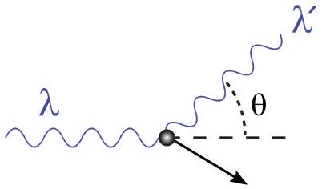

Q7 total: 11
8. A photon with wavelength $\lambda$ scatters at an angle $\theta$ off an electron of mass $m$ initially at rest, as shown in Fig. 1. Denote the wavelength of the scattered photon as $\lambda^{\prime}$.

Figure 1: By JabberWok, CC BY-SA 3.0 https://commons.wikimedia.org/w/index.php?curid=2078004

(a) Write down a relativistic expression for the electron energy $E$ after the scattering event, in terms of its rest-mass $m$, the magnitude $P$ of its momentum, and the speed of light in vacuum $c$.
(b) By considering momentum conservation, show that
$$
P^{2}=h^{2}\left(\frac{1}{\lambda^{2}}+\frac{1}{\left(\lambda^{\prime}\right)^{2}}-\frac{2 \cos \theta}{\lambda \lambda^{\prime}}\right),
$$
where $h$ is the Planck constant.

(c) By also considering energy conservation, show that [4]
$$
\lambda^{\prime}-\lambda=\lambda_{C}(1-\cos \theta),
$$
where $\lambda_{C}$ is known as the Compton wavelength. Determine an expression for $\lambda_{C}$ in terms of fundamental constants.
(d) Compton's original experiment was based on X-rays bombarding a graphite target. He found that some X-rays experienced no wavelength shift despite being scattered through large angles. Suggest an explanation for this.
