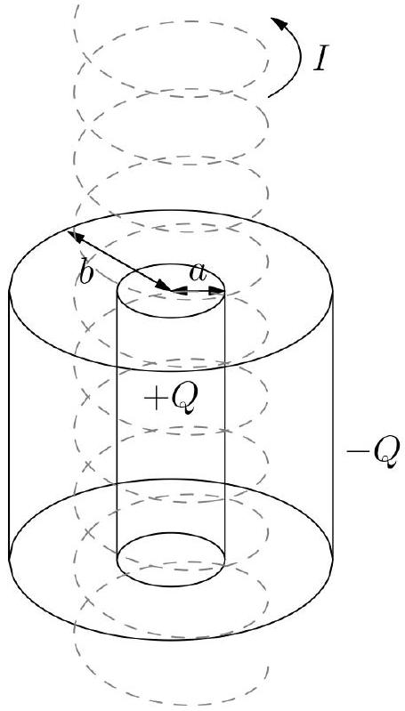

4. The energy transferred by an electromagnetic wave per unit time per unit surface area is given by the Poynting vector

$$
\mathbf{S}=\frac{1}{\mu_{0}} \mathbf{E} \times \mathbf{B},
$$

where the direction of the vector $\mathbf{S}$ is the direction of energy transfer.

(a) Show the volume density of the linear momentum of an electromagnetic wave is $\mathbf{p}_{V}=\frac{1}{c^{2} \mu_{0}} \mathbf{E} \times \mathbf{B}$, where $c$ is the speed of light.

We now consider a "paradox" regarding the conservation of angular momentum. Two long, coaxial cylindrical shells, shown in the figure, both have length $l$. The inner one has radius $a$ and electric charge $+Q$ uniformly distributed along its surface, while the outer one has radius $b>a$ and electric charge $-Q$ uniformly distributed over its surface.
The cylinders are made of the same material, having mass per unit area equal to $\sigma$. Between them, there is another long solenoid with radius $R(a<R<b)$ that is also coaxial with the two cylinders. The solenoid has $n$ turns per unit length and carries an electric current $I$.

The solenoid is held fixed in space, but the cylindrical shells can freely and independently rotate around their common axis. Initially, all parts of the system are at rest. When the current in the solenoid is gradually reduced to zero, the cylinders begin to rotate.

(b) Find the final angular velocities of each of the cylinders, giving their magnitude and orientation.
(c) Since no external force acts on the system, the net angular momentum should be conserved. Where did the extra angular momentum come from? Support your answer with equations.
