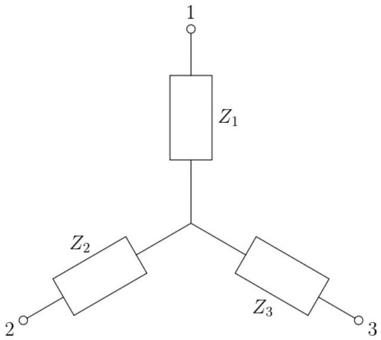

5. Three circuit elements are connected to a central junction in a "star" shape, as shown in the figure. One is a resistor, one is an inductor, and one is a capacitor, although it is not known which is which.

A physicist connects an AC source with fixed voltage $V_{s}$ across a pair of terminals, at the same time connecting an AC voltmeter to one of the terminals (the other end of the voltmeter is always fixed at the central junction). She obtains the following readings:

(a) Determine the value of $V_{s}$ (i.e. the reading on the AC voltmeter when it is hooked up directly to the AC source).

| AC source terminals | AC voltmeter terminal | Voltmeter reading |
| :--- | :--- | :--- |
| 1 \& 2 | 1 | 20.8 V |
| 1 \& 2 | 2 | 15.6 V |
| 1 \& 3 | 1 | 24.0 V |
| 1 \& 3 | 3 | 10.0 V |
| 2 \& 3 | 2 | 58.5 V |
| 2 \& 3 | 3 | 32.5 V |

(b) Determine the possible identities of $Z_{1}, Z_{2}, Z_{3}$ (i.e. which is the resistor, inductor, capacitor).
(c) Now, an AC ammeter is also connected in series with the AC source. Find the ratio of currents $I_{12}: I_{13}: I_{23}$, where $I_{i j}$ denotes the value on the AC ammeter when the AC source is connected to terminals $i$ and $j$.
