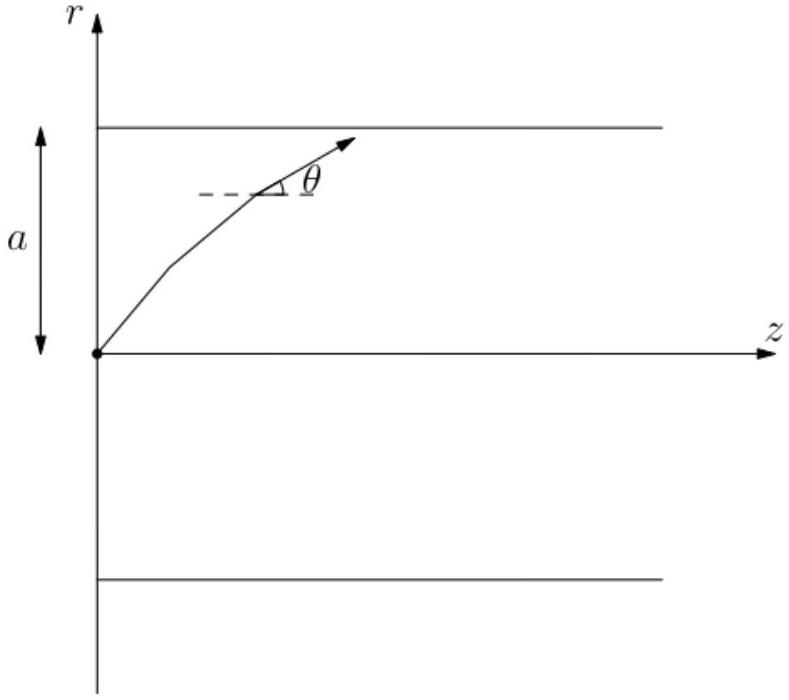

8. This question is on pulse spreading in fibre optics.

Consider a cylindrical optical fibre in the region $0 \leq r \leq a$ for $z>0$, see diagram. There is a light source at $r=z=0$ that emits monochromatic waves. The refractive index $n(r)$ is a function of the radial distance from the cylindrical axis.

Along the path of a ray, if the refractive index at some point is $n$ and the angle the ray makes with the horizontal ( $z$-axis) is $\theta$, we may use Snell's Law to conclude that

$$
n \cos \theta=\tilde{\beta}
$$

is a constant at all points along the path of the ray.

(a) Show that the path that a ray takes satisfies
$$
\frac{d^{2} r}{d z^{2}}=\frac{1}{2 \tilde{\beta}^{2}} \frac{d\left(n(r)^{2}\right)}{d r}
$$
This is known as the ray equation.
(b) The fibre is characterised by the following refractive index distribution:
$$
n(r)^{2}=n_{1}^{2}\left[1-2 \Delta\left(\frac{r}{a}\right)^{2}\right], \quad 0 \leq r \leq a
$$

where $\Delta \ll 1$ and $n_{1}$ are constants.
The refractive index of the medium outside the optical fibre is uniform, with the value $n_{2}$ given by

$$
n(r)^{2}=n_{2}^{2}=n_{1}^{2}(1-2 \Delta), \quad r>a .
$$

The initial angle of projection $\theta_{1}$ has to be small enough for the ray to return to the $z$-axis.

i. Assuming this is the case, find the equation of the path $r=r(z)$ taken by the ray of light, as well as the position $z_{1}$ of the first instance that the ray returns to the $z$-axis. Express your answers in terms of $n_{1}, \Delta, a$, and $\tilde{\beta}$.
ii. If $\theta_{1} \ll 1$ such that we make the approximation $\cos \theta_{1} \approx 1$, state the value of $z_{1}$.
iii. Find the maximum possible value of $\theta_{1}$, in terms of $\Delta$.
(c) One of the important characteristics of a waveguide is pulse dispersion, the temporal spreading of a pulse of light launched into the waveguide. This is due to the difference in time taken by different rays. To calculate this dispersion, we calculate the time taken by a ray to traverse a given length of the waveguide.
Define the maximum radial distance the ray reaches from the $z$-axis to be $r_{t}$. Show that the time taken for the light ray to first reach a distance $r_{t}$ from the $z$-axis is given by
$$
\frac{1}{c} \int_{0}^{r_{t}} \frac{n(r)^{2}}{\sqrt{n(r)^{2}-\tilde{\beta}^{2}}} d r
$$
where $c$ is the speed of light in vacuum.
(d) For the fibre optic medium described in (b):
    i. Find the time taken for a light ray to first reach a distance $r_{t}$ from the $z$-axis, expressing your answer in terms of $a, n_{1}, \tilde{\beta}, \Delta$, and $c$.
    ii. Calculate the difference in the maximum and minimum times for rays to travel a distance $z$ along the $z$-axis, in terms of $n_{1}, \Delta$, and $c$. This time difference $\tau$ can be taken to be the pulse dispersion time.
(e) To appreciate the small dispersion given in the previous part, let us consider the pulse dispersion in a cylindrical fibre optic medium with the same physical dimensions but with homogeneous refractive index $n_{1}$, while the outside is still kept at refractive index $n_{2}$ satisfying $n_{2}^{2}=n_{1}^{2}(1-2 \Delta)$.
Find the pulse dispersion time over a distance $z$ along the $z$-axis for such a setup, in terms of $n_{1}, \Delta$, and $c$.
