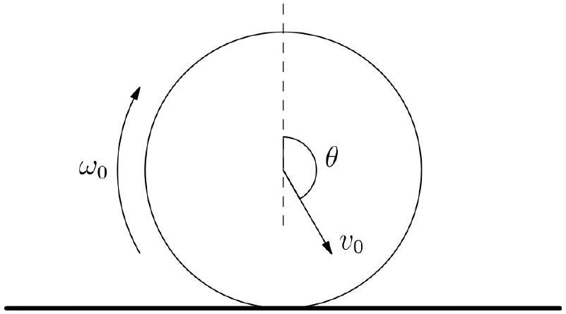

1. A thin uniform ring of mass $m$ falls onto a rough floor. The initial velocity of the centre of mass is $v_{0}$, at an angle $\theta$ clockwise from the upwards vertical when it contacts the floor (refer to the diagram). It is also rotating with angular velocity $\omega_{0}$ clockwise. The ground is rough enough so that the ring achieves no-slipping right after it contacts the ground. Denote the coefficient of restitution as $e$ and the gravitational acceleration as $g$.

    (a) Find the velocity of the ring after the first bounce, and its angular velocity.
    (b) Suppose the ring bounces straight up after touching the ground. Find the maximum height reached by the ring.
