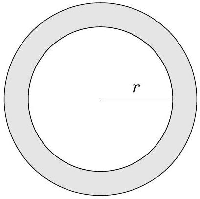
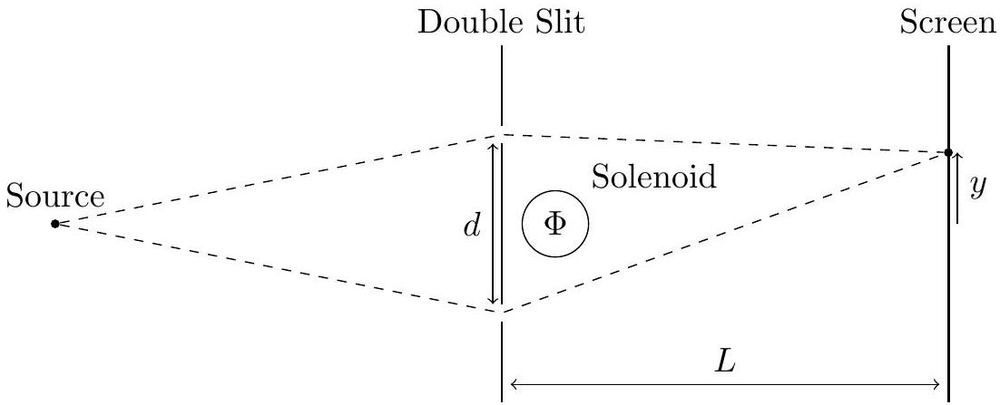

6. An electron is confined to move along the circumference of a thin ring with radius $r$.
(a) Find the allowed values of its kinetic energy, giving your answer in terms of the electron mass $m$ and Planck's constant $h$.

The ring is now placed in a constant (but not necessarily uniform) magnetic field directed into the page, such that the magnetic flux through the ring is $\Phi$.

Figure 1: Illustration of the ring.

(b) By considering the energy contribution from the current of the moving charge, show that the total energy of the system (up to an additive constant) is given by
$$
E=\frac{p_{\mathrm{eff}}^{2}}{2 m}=\frac{1}{2 m}\left(p+\frac{e \Phi}{2 \pi r}\right)^{2}
$$
where $p$ is the electron's momentum (treating anticlockwise as positive) and $-e$ is the charge of the electron.
(c) Treating $p_{\text {eff }}$ as the total effective momentum of the electron's quantum wave, find the magnitude and direction of the current flowing in the ring in the ground state(s) and first excited state(s) of the electron's kinetic energy when $\Phi=\frac{h}{2 e}$.

A typical electron double-slit experiment is set up as shown in the diagram below, with a solenoid placed just behind the two slits. The width of each slit is small but finite. The velocity of the electron beam is $v$, the distance between the slits is $d$, and the distance from the slits to the screen is $L \gg d$. The magnetic field of the solenoid is directed into the page, and the total magnetic flux through the solenoid is $\Phi=\frac{N h}{2 e}$, where $N$ is the number of coils in the solenoid.

Figure 2: Illustration of the electron double-slit experiment.

(d) Sketch the intensity of electrons detected as a function of the vertical position $y$ along the screen. Include the distance between extrema in the sketch.
