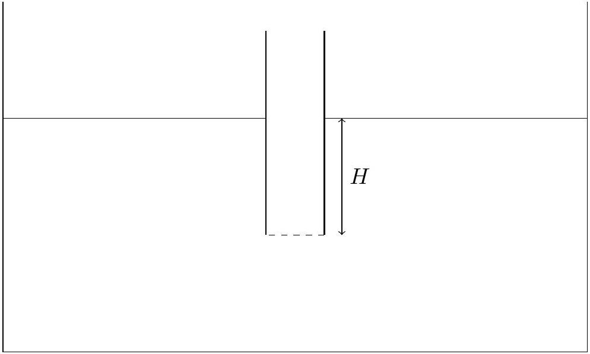

7. A straw with its bottom end covered is placed in a large tank of water such that its bottom end is $H$ below the surface of the water. At $t=0$ the barrier (dashed) vanishes.

    (a) Use Bernoulli's principle to find the total time it takes for the water to reach the surface level inside the tube. Explain why this value may be inaccurate.
    (b) The Navier-Stokes equation (1) can be used to obtain a more accurate solution.
$$
\frac{\partial \overrightarrow{\mathbf{u}}}{\partial t}+(\overrightarrow{\mathbf{u}} \cdot \nabla) \overrightarrow{\mathbf{u}}=-\frac{\nabla P}{\rho}+\overrightarrow{\mathbf{g}}
$$
Assuming irrotational flow such that $\overrightarrow{\mathbf{u}}=\nabla \phi(x, y, z, t)$. Show that the equation reduces to (2) where $C$ is a constant. (Hint: You may want to use the fact that $\overrightarrow{\mathbf{A}} \times(\nabla \times \overrightarrow{\mathbf{A}})=$ $\frac{1}{2} \nabla A^{2}-(\overrightarrow{\mathbf{A}} \cdot \nabla) \overrightarrow{\mathbf{A}}$ for any vector field $\overrightarrow{\mathbf{A}}$.)
$$
\frac{\partial \phi}{\partial t}+\frac{u^{2}}{2}+\frac{P}{\rho}+g z=C
$$
    (c) Find the function $\phi$ for the region inside the straw in terms of velocity of the water surface at the top of the straw and $z$ (the vertical distance from the bottom of the straw). Explain how you arrived at the answer.
(d) Using (2) determine the maximum height that the water can reach above the surrounding water level outside the straw. (Hint: The substitution $r=\frac{v_{z}^{2}}{2}$ may be useful)
