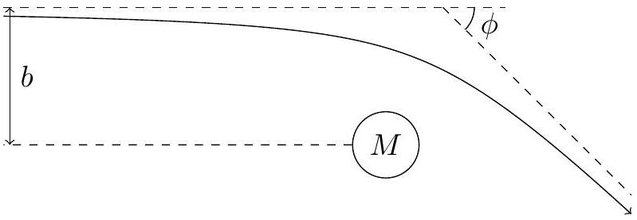

9. From special relativity, it is known that energy and mass are equivalent and interchangeable. Some of the results of general relativity can be obtained by treating the gravitational mass as $m_{g}=\frac{F}{c^{2}}$, where $F$ is the total non-potential energy of the particle.
    (a) Consider a photon fired radially outwards from a large mass $M$. If the frequency received by an observer infinitely far away is $f_{0}$, determine its frequency $f(r)$ as a function of the radial distance $r \gg \frac{G M}{c^{2}}$ away from the large mass.
    (b) Hence, find the effective Lorentz factor $\gamma_{g}(r)$ by which time and length are dilated and contracted with respect to an observer at infinity, and determine the speed $v$ at which a non-accelerating frame would experience the same effect.

To account for these effects, under weak gravity $\left(r \gg \frac{G M}{c^{2}}\right)$, the usual invariant proper time interval can be modified to

$$
d \tau^{2}=\left(1-\frac{2 G M}{r c^{2}}\right) d t^{2}-\frac{1}{c^{2}}\left[\left(1+\frac{2 G M}{r c^{2}}\right) d r^{2}+r^{2} d \theta^{2}\right]
$$

where the coordinates $(r, \theta)$ are the usual polar coordinates with mass $M$ at the origin, and all coordinates are taken with respect to an observer at infinity.

A particle of mass $m$ is fired towards an object of mass $M$ from very far away with impact parameter $b \gg \frac{G M}{c^{2}}$ and initial velocity $u$, such that the particle's trajectory is deflected by an angle $\phi \ll 1$.

(c) Show that the total energy of the particle is given by
$$
E^{2}=\frac{c^{2}}{\alpha^{2}}\left(m^{2} c^{2}+\alpha^{2} p_{r}^{2}+r^{2} p_{\theta}^{2}\right)
$$
where $p_{x}=m \frac{d x}{d \tau}$ is the $x$-component of the particle's momentum and $\alpha=1+\frac{G M}{r c^{2}}$.
[Hint: If $d s^{2}=A d x^{2}+B d y^{2}$, then $\vec{a} \cdot \vec{b}=A a_{x} b_{x}+B a_{y} b_{y}$.]
(d) Show that this effectively reduces to an additional central force acting on the particle of the form
$$
\vec{F}=\frac{d \vec{p}}{d \tau}=-\frac{\beta}{r^{4}} \hat{r}
$$
where $\beta$ is some constant you should determine.
(e) Hence or otherwise, determine the angle of deflection $\phi$ to leading order in $\frac{G M}{b c^{2}}$ and compare your results for a massive particle $(u \ll c)$ and a photon $(u=c)$ to the classical case $\left(\phi=\frac{2 G M}{b u^{2}}\right)$.
You may make use of the following integral without proof:
$$
\int_{-\infty}^{\infty} \frac{d x}{\left(x^{2}+1\right)^{k}}= \begin{cases}2 & \left(k=\frac{3}{2}\right) \\ \frac{4}{3} & \left(k=\frac{5}{2}\right)\end{cases}
$$

Fundamental Physical Constants - Frequently used constants
| Quantity | Symbol | Value | Unit | Relative std. uncert. $u_{\mathrm{r}}$ |
| :--- | :--- | :--- | :--- | :--- |
| speed of light in vacuum | $c$ | 299792458 | $\mathrm{m} \mathrm{s}^{-1}$ | exact |
| Newtonian constant of gravitation | $G$ | $6.67430(15) \times 10^{-11}$ | $\mathrm{m}^{3} \mathrm{~kg}^{-1} \mathrm{~s}^{-2}$ | $2.2 \times 10^{-5}$ |
| Planck constant* | $h$ | $6.62607015 \times 10^{-34}$ | $\mathrm{J} \mathrm{Hz}^{-1}$ | exact |
|  | え | $1.054571817 \ldots \times 10^{-34}$ | J s | exact |
| elementary charge | $e$ | $1.602176634 \times 10^{-19}$ | C | exact |
| vacuum magnetic permeability $4 \pi \alpha \hbar / e^{2} c$ | $\mu_{0}$ | $1.25663706212(19) \times 10^{-6}$ | $\mathrm{NA}^{-2}$ | $1.5 \times 10^{-10}$ |
| vacuum electric permittivity $1 / \mu_{0} c^{2}$ | $\epsilon_{0}$ | $8.8541878128(13) \times 10^{-12}$ | $\mathrm{F} \mathrm{m}^{-1}$ | $1.5 \times 10^{-10}$ |
| Josephson constant $2 e / h$ | $K_{\mathrm{J}}$ | $483597.8484 \ldots \times 10^{9}$ | $\mathrm{Hz} \mathrm{V}^{-1}$ | exact |
| von Klitzing constant $\mu_{0} c / 2 \alpha=2 \pi \hbar / e^{2}$ | $R_{\mathrm{K}}$ | $25812.80745 \ldots$ | $\Omega$ | exact |
| magnetic flux quantum $2 \pi \hbar /(2 e)$ | $\Phi_{0}$ | $2.067833848 \ldots \times 10^{-15}$ | Wb | exact |
| conductance quantum $2 e^{2} / 2 \pi \hbar$ | $G_{0}$ | $7.748091729 \ldots \times 10^{-5}$ | S | exact |
| electron mass | $m_{\mathrm{e}}$ | $9.1093837015(28) \times 10^{-31}$ | kg | $3.0 \times 10^{-10}$ |
| proton mass | $m_{\mathrm{p}}$ | $1.67262192369(51) \times 10^{-27}$ | kg | $3.1 \times 10^{-10}$ |
| proton-electron mass ratio | $m_{\mathrm{p}} / m_{\mathrm{e}}$ | 1836.152673 43(11) |  | $6.0 \times 10^{-11}$ |
| fine-structure constant $e^{2} / 4 \pi \epsilon_{0} \hbar c$ | $\alpha$ | $7.2973525693(11) \times 10^{-3}$ |  | $1.5 \times 10^{-10}$ |
| inverse fine-structure constant | $\alpha^{-1}$ | 137.035999 084(21) |  | $1.5 \times 10^{-10}$ |
| Rydberg frequency $\alpha^{2} m_{\mathrm{e}} c^{2} / 2 h$ | $c R_{\infty}$ | $3.2898419602508(64) \times 10^{15}$ | Hz | $1.9 \times 10^{-12}$ |
| Boltzmann constant | $k$ | $1.380649 \times 10^{-23}$ | $\mathrm{J} \mathrm{K}^{-1}$ | exact |
| Avogadro constant | $N_{\mathrm{A}}$ | $6.02214076 \times 10^{23}$ | $\mathrm{mol}^{-1}$ | exact |
| molar gas constant $N_{\mathrm{A}} k$ | $R$ | 8.314462618... | $\mathrm{J} \mathrm{mol}^{-1} \mathrm{~K}^{-1}$ | exact |
| Faraday constant $N_{\mathrm{A}} e$ | $F$ | $96485.33212 \ldots$. | $\mathrm{C} \mathrm{mol}^{-1}$ | exact |
| Stefan-Boltzmann constant |  |  |  |  |
| $\left(\pi^{2} / 60\right) k^{4} / \hbar^{3} c^{2}$ | $\sigma$ | $5.670374419 \ldots \times 10^{-8}$ | $\mathrm{W} \mathrm{m}^{-2} \mathrm{~K}^{-4}$ | exact |
| Non-SI units accepted for use with the SI |  |  |  |  |
| electron volt ( $e / \mathrm{C}$ ) J | eV | $1.602176634 \times 10^{-19}$ | J | exact |
| (unified) atomic mass unit $\frac{1}{12} m\left({ }^{12} \mathrm{C}\right)$ | u | $1.66053906660(50) \times 10^{-27}$ | kg | $3.0 \times 10^{-10}$ |

[^0]
[^0]:    * The energy of a photon with frequency $\nu$ expressed in unit Hz is $E=h \nu$ in J . Unitary time evolution of the state of this photon is given by $\exp (-i E t / \hbar)|\varphi\rangle$, where $|\varphi\rangle$ is the photon state at time $t=0$ and time is expressed in unit s. The ratio $E t / \hbar$ is a phase.
