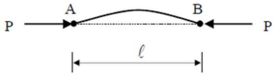
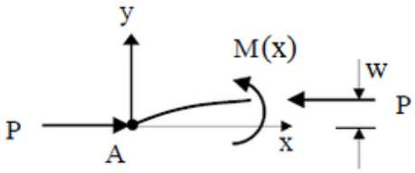
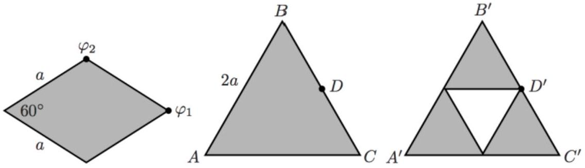

## 4. Part A: Scaling Laws in a Column

Consider a solid cylindrical column of diameter $d$ and height $h$ supporting a sphere of diameter $D$ on top. Assume that $D \gg d$, such that the contact area between the sphere and column is effectively the cross-sectional area of the column.

(a) Suppose the diameter of the column is just sufficient to withstand the compressive load of the sphere. How should $d$ scale with $D$, i.e. what should be the exponent $\alpha$ such that $d \propto D^{\alpha}$ ? (Hint: The maximum stress that the solid column can withstand is a constant. Assume even stress across the contact area.)

Another possible mode of structural failure is buckling. According to the Euler-Bernoulli beam theory, the deflection $w$ of a beam is related to its bending moment $M$ by

$$
M(x)=E I \frac{d^{2} w}{d x^{2}}
$$

where $E$ is the Young's modulus of the material (a constant), and $I=\int r^{2} d A$ is the second moment of area about its central axis (analogous to the moment of inertia, but involving the cross-sectional area $d A$ instead of the mass $d m$ ).

For example, in the figure above, a horizontal load $P$ is applied inwards to both ends of a beam, causing deflections $w(x)$. The horizontal load causes a bending moment $M(x)=$ $P w(x)$. Above a critical load $P_{\text {crit }}$, the beam will undergo buckling.

(b) Consider the sphere-column system introduced in part (a). Given that $h \propto D$, how should $d$ scale with $D$ in order to prevent buckling?

Part B: Scaling of Gravitational Potentials
A massive thin rhombus plate, with side length $a$ and acute apex angle 60°, has uniform surface mass density $\sigma$. The gravitational potential at the vertex of the acute angle of the rhombus is equal to $\varphi_{1}$, and the potential at the vertex of the obtuse angle is $\varphi_{2}$ (see first object in the figure).

(c) An equilateral triangle of side length $2 a$ (see second object in the figure) has the same uniform mass density $\sigma$. Find the gravitational potential at points C and D. Leave your answers in terms of $\varphi_{1}$ and $\varphi_{2}$.
(d) An equilateral triangle of side $a$ (see third object in the figure) is cut out from the center. Find the new potential at C' and D'. Leave your answer in terms of $\varphi_{1}$ and $\varphi_{2}$.
