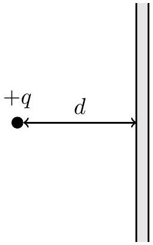
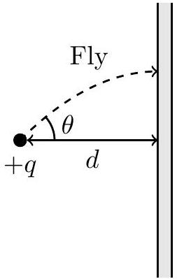

5. Consider a point charge $+q$ placed at a fixed distance $d$ from an infinitely large, thin, conducting plane.

A small fly, initially on the point charge, takes off with an initial angle $\theta$ from the horizontal. Flying at a constant speed $v$, it follows the path of an electric field line until it reaches the plane (this diagram is not drawn to scale).

    (a) Define the coordinates $(x, y)$ such that the plane is at $x=0$, and the point charge is at $(-d, 0)$. Determine $E_{x}$ and $E_{y}$, the $x$ and $y$ components of the electric field, for all points $(x, y)$ in $x<0$.
    (b) The electric field line illustrated terminates at $\left(0, y_{0}\right)$. Determine $y_{0}$, leaving your answer in terms of $d$ and $\theta$. (Hint: The curved surface area of a sphere sector with half-angle $\theta$ is $\frac{1}{2}(1-\cos \theta)$ of the total surface area of the sphere.)
    (c) Find the instantaneous acceleration of the fly $a$ as it reaches the plane. Leave your answer in terms of $v, d$ and $\theta$. (Hint: The radius of curvature $R$ of a curve $y(x)$ is given by $R=\left|\frac{\left(1+y^{\prime 2}\right)^{\frac{3}{2}}}{y^{\prime \prime}}\right|$, where primes denote a derivative with respect to $x$.)
