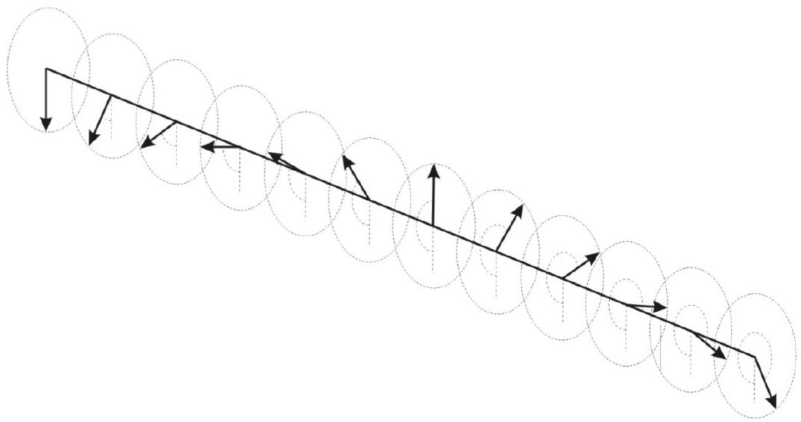

10. We know that for all solutions to the linear wave equation, the principle of superposition applies. Examples include electromagnetic waves and waves on a string.
Dispersion relations describe the relation between angular velocity $\omega(k)$ and wavenumber $k$, where phase velocity can be obtained as $v_{p}=\frac{\omega}{k}$. Each wave component has its own phase velocity, propagating independently of each other.

However, in nonlinear dynamics, this is no longer the case. Interfering wave packets interact, leading to nontrivial behaviour; in dispersive media, nonlinear interactions can even preserve wave packets and oppose dispersion. These wave packets are called solitons.
To investigate solitons, we will look at a simple mechanical system. Consider a long taut horizontal string, to which at equal intervals $b$, identical spokes arranged vertically are attached. These spokes can be considered as pendulums swinging in the plane perpendicular to the string axis. The weight of each spoke is $m$, the distance from the center of mass of the spoke to the string is $d$, and the moment of inertia relative to the axis passing through the string is $I$. When one spoke deviates from the neighboring one by an angle $\Delta \phi$, the string creates a restoring torsional torque $\tau=-K \Delta \phi$.
It can be assumed that the characteristic size of the soliton $\lambda \gg b$. Hence, consider that the angular coordinate at some point $x$ along the string is given by a continuous function $\phi(x, t) ; \phi=0$ is defined at the position where the pendulum points vertically downwards, and increases as the pendulum rotates anticlockwise.

Take the level of a line passing through the lowest possible positions of the center of mass of the spokes as zero of the potential energy in the gravitational field.

(a) Assuming the absence of gravity first: obtain a differential equation for $\phi(x, t)$ of the following form
$$
\frac{\partial^{2} \phi(x, t)}{\partial t^{2}}=\alpha \frac{\partial^{2} \phi(x, t)}{\partial x^{2}}
$$
where $\alpha$ is some constant.
(b) Using the substitution $\phi(x, t)=f(x \pm v t)$, find the speed of linear wave propagation $v_{0}$ for the scenario in (a). Show your substitution clearly.
(c) Now, considering gravity, obtain a differential equation for $\phi(x, t)$ of the following form $\beta \frac{\partial^{2} \phi(x, t)}{\partial t^{2}}-\gamma \frac{\partial^{2} \phi(x, t)}{\partial x^{2}}+\delta \sin \phi(x, t)=0$
where $\beta, \gamma$, and $\delta$ are constants to determined. DO NOT use the small angle approximation.
(d) Deduce the maximum speed of wave propagation $v_{\text {max }}$ for the scenario in (c). Justify your answer.

The equation given in (c), ignoring coefficients, is called the Sine-Gordon equation; it is a generalisation of the Klein-Gordon equation

$$
\frac{\partial^{2} \phi(x, t)}{\partial t^{2}}-\frac{\partial^{2} \phi(x, t)}{\partial x^{2}}+\phi(x, t)=0
$$

which is a relativistic quantum wave equation for spin-0 particles. (But don't worry - we are not doing quantum field theory here). In this equation, $\phi(x, t)$ is a field variable; which we gave a physical interpretation as the angular displacement in our mechanical model. Fields possess energy and momenta, not unlike electromagnetic fields. However, the exact nature of these conserved quantities may differ. Note that you do not have to worry about what appears to be inconsistent units - the equation is non-dimensionalised.
Continue to make reference to the pendulum model whenever necessary.

(e) Work with the Klein-Gordon equation. Using the ansatz $\phi(x, t)=A e^{i(k x \pm \omega t)}$, obtain the dispersion relation $\omega(k)$.

These are still linear waves with a well-defined dispersion relation. The waves propagate independently and at different speeds; hence wavepackets spread out over time. To better understand nonlinear waves, let us study the soliton solutions of the Sine-Gordon equation.

(f) Show that $\phi_{s}(x)=4 \arctan e^{ \pm x}$ is a solution to the Sine-Gordon equation for a static soliton in equilibrium. To simplify things, proving for just the plus case $\phi_{s}(x)=$

$4 \arctan e^{x}$ is sufficient. Sketch a graph of $\phi_{s}(x)$ for both cases on the same graph and label the asymptotes.
Hint: $\frac{d}{d x} \arctan x=\frac{1}{1+x^{2}}$

From here on, we will use kink and anti-kink to describe the plus and minus soliton solutions in (f) respectively.

(g) Find the energy $E_{0}$ of a static kink.
Hint: Energy is also non-dimensionalised; do not use constants from the mechanical model such as $m$ and $I$ in your answers.
(h) i. Let $x^{\prime}$ and $t^{\prime}$ be the coordinates in a frame moving at relativistic speed $v$ in the positive $x$-direction. Express $x^{\prime}$ and $t^{\prime}$ in terms of $x$ and $t$.
    ii. In terms of $\phi(x, t)$, the field expressed in the moving frame $\phi^{\prime}\left(x^{\prime}, t^{\prime}\right)=\phi(x, t)$, and the respective coordinates, state an equation which shows that the Sine-Gordan equation is invariant under a Lorentz transformation.

From here on, you may assume the Sine-Gordan equation to be Lorentz invariant.

(i) Using your results in (f) and (h), find the solution $\phi_{k}(x, t)$ to a solitary kink propagating at speed $v$ in the positive $x$-direction.
(j) What is the energy $E_{v}$ of a kink propagating at speed $v$ ? Express your answer in terms of $E_{0}$ and $v$.
(k) Now, consider two static kinks separated by a very large distance $D$. By considering the energy density or otherwise, deduce and justify a scaling relation between the interaction energy $\Delta E$ and the distance of separation $D$.
(l) Using your results in (k), deduce whether the interaction force of each pair below are attractive or repulsive.

a. kink - kink
b. kink - antikink
c. antikink - antikink

Fundamental Physical Constants - Frequently used constants
| Quantity | Symbol | Value | Unit | Relative std. uncert. $u_{\mathrm{r}}$ |
| :--- | :--- | :--- | :--- | :--- |
| speed of light in vacuum | $c$ | 299792458 | $\mathrm{m} \mathrm{s}^{-1}$ | exact |
| Newtonian constant of gravitation | $G$ | $6.67430(15) \times 10^{-11}$ | $\mathrm{m}^{3} \mathrm{~kg}^{-1} \mathrm{~s}^{-2}$ | $2.2 \times 10^{-5}$ |
| Planck constant* | $h$ | $6.62607015 \times 10^{-34}$ | $\mathrm{J} \mathrm{Hz}^{-1}$ | exact |
|  | ћ | $1.054571817 \ldots \times 10^{-34}$ | J s | exact |
| elementary charge | $e$ | $1.602176634 \times 10^{-19}$ | C | exact |
| vacuum magnetic permeability $4 \pi \alpha \hbar / e^{2} c$ | $\mu_{0}$ | $1.25663706127(20) \times 10^{-6}$ | $\mathrm{N} \mathrm{A}^{-2}$ | $1.6 \times 10^{-10}$ |
| vacuum electric permittivity $1 / \mu_{0} c^{2}$ | $\epsilon_{0}$ | $8.8541878188(14) \times 10^{-12}$ | $\mathrm{F} \mathrm{m}^{-1}$ | $1.6 \times 10^{-10}$ |
| Josephson constant $2 e / h$ | $K_{\mathrm{J}}$ | $483597.8484 \ldots \times 10^{9}$ | $\mathrm{Hz} \mathrm{V}^{-1}$ | exact |
| von Klitzing constant $\mu_{0} c / 2 \alpha=2 \pi \hbar / e^{2}$ | $R_{\mathrm{K}}$ | $25812.80745 \ldots$ | $\Omega$ | exact |
| magnetic flux quantum $2 \pi \hbar /(2 e)$ | $\Phi_{0}$ | $2.067833848 \ldots \times 10^{-15}$ | Wb | exact |
| conductance quantum $2 e^{2} / 2 \pi \hbar$ | $G_{0}$ | $7.748091729 \ldots \times 10^{-5}$ | S | exact |
| electron mass | $m_{\mathrm{e}}$ | $9.1093837139(28) \times 10^{-31}$ | kg | $3.1 \times 10^{-10}$ |
| proton mass | $m_{\mathrm{p}}$ | $1.67262192595(52) \times 10^{-27}$ | kg | $3.1 \times 10^{-10}$ |
| proton-electron mass ratio | $m_{\mathrm{p}} / m_{\mathrm{e}}$ | 1836.152673 426(32) |  | $1.7 \times 10^{-11}$ |
| fine-structure constant $e^{2} / 4 \pi \epsilon_{0} \hbar c$ | $\alpha$ | $7.2973525643(11) \times 10^{-3}$ |  | $1.6 \times 10^{-10}$ |
| inverse fine-structure constant | $\alpha^{-1}$ | 137.035999 177(21) |  | $1.6 \times 10^{-10}$ |
| Rydberg frequency $\alpha^{2} m_{\mathrm{e}} c^{2} / 2 h$ | $c R_{\infty}$ | $3.2898419602500(36) \times 10^{15}$ | Hz | $1.1 \times 10^{-12}$ |
| Boltzmann constant | $k$ | $1.380649 \times 10^{-23}$ | $\mathrm{J} \mathrm{K}^{-1}$ | exact |
| Avogadro constant | $N_{\mathrm{A}}$ | $6.02214076 \times 10^{23}$ | $\mathrm{mol}^{-1}$ | exact |
| molar gas constant $N_{\mathrm{A}} k$ | $R$ | 8.314462618 … | $\mathrm{J} \mathrm{mol}^{-1} \mathrm{~K}^{-1}$ | exact |
| Faraday constant $N_{\mathrm{A}} e$ | $F$ | $96485.33212 \ldots$. | $\mathrm{C} \mathrm{mol}^{-1}$ | exact |
| Stefan-Boltzmann constant $\left(\pi^{2} / 60\right) k^{4} / \hbar^{3} c^{2}$ | $\sigma$ | $5.670374419 \ldots \times 10^{-8}$ | $\mathrm{W} \mathrm{m}^{-2} \mathrm{~K}^{-4}$ | exact |
| Non-SI units accepted for use with the SI |  |  |  |  |
| electron volt ( $e / \mathrm{C}$ ) J | eV | $1.602176634 \times 10^{-19}$ | J | exact |
| (unified) atomic mass unit $\frac{1}{12} m\left({ }^{12} \mathrm{C}\right)$ | u | $1.66053906892(52) \times 10^{-27}$ | kg | $3.1 \times 10^{-10}$ |

[^0]
[^0]:    * The energy of a photon with frequency $\nu$ expressed in unit Hz is $E=h \nu$ in J. Unitary time evolution of the state of this photon is given by $\exp (-i E t / \hbar)|\varphi\rangle$, where $|\varphi\rangle$ is the photon state at time $t=0$ and time is expressed in unit s. The ratio $E t / \hbar$ is a phase.
