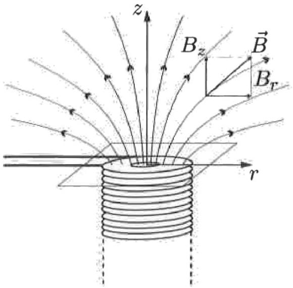

4. Optical microscopes use optical lenses to bend light and form images. Electron microscopes on the other hand rely on electromagnetic fields to bend electrons. We will explore the properties of a magnetic lens in the following question. For all parts below we will work in cylindrical coordinates $(r, \theta, z)$ with the origin coninciding with the center of the top face of the magnet.

We can use a cylindrically symmetric magnetic field as a lens. Near the central axis of the magnet (small $r$ ), the $z$ component of the field can be approximated by
$$
B_{z}(z)=\frac{B_{0}}{1+\left(\frac{z}{a}\right)^{2}}
$$
where $a$ is some constant.
    (a) Show that the radial magnetic field $B_{r}$ near the central axis is given by
$$
B_{r}=-\frac{r}{2} \frac{d B_{z}}{d z}
$$

(b) By considering the equation of motion for an electron with mass $m$ and charge $-e$ originating far away from the lens with some initial position $\left(r_{0}, \theta_{0}, z_{0}\right)$, show that the angular position of the electron is governed by
$$
\dot{\theta}=\frac{e}{2 m} B_{z}
$$
You may assume that the electrons are paraxial ( $r_{0}$ is small) and that the initial speed $v$ of the electron is almost entirely in $z$ direction $\left(v \approx v_{z}\right)$ at all times.
(c) From the equation of motion in the radial direction, derive the following equation relating $z$ and $r$ for the trajectory of the particle:
$$
\frac{d^{2} y}{d x^{2}}=-\frac{k^{2}}{\left(1+x^{2}\right)^{2}} y
$$
where $y=\frac{r}{a}, x=\frac{z}{a}$ and $k$ is to be determined in terms of the electron's initial kinetic energy, $E$, its mass, $m$, and other constants.
(d) The general solution to the equation can be found using the substitutions $x=\frac{z}{a}=\cot (\phi)$ and $y=\frac{r}{a}$ :
$$
y(\phi)=C_{1} \frac{\sin (\omega \phi)}{\sin \phi}+C_{2} \frac{\cos (\omega \phi)}{\sin \phi}, \quad \text { where } \omega=\sqrt{1+k^{2}}
$$
where $C_{1}$ and $C_{2}$ depend on the initial direction and position of the electron. If a point source of electrons emitting electrons in all directions is at some point $P_{0}\left(y_{0}, \phi_{0}\right)$, determine the $\phi$ values ( $\phi_{n}$ ) where the emitted electrons converge. Also determine the minimum $k$ such that two images will be formed for any $\phi_{0}$.
