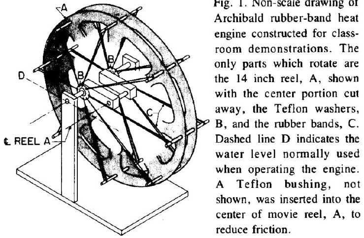
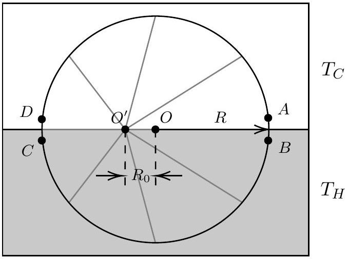
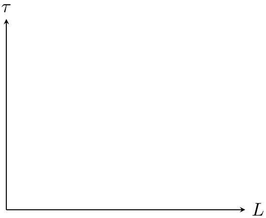

5. In this problem, we will study the thermodynamics of an unusual heat engine, known as an Archibald rubber band heat engine.

This heat engine consists of a series of rubber bands with one end attached to the circumference of a wheel with radius $R$, and the other end fastened to a frictionless bearing, whose center is offset from the wheel's central axis of rotation by a distance $R_{0}$. Both the wheel's axis and rubber band axis are fixed and do not move.
A "heat engine" can be constructed by submerging the bottom half of the assembly in hot water with uniform temperature $T_{H}$, which causes the wheel and attached bands to rotate. The top half remains at ambient temperature $T_{C}$. A clearer diagram is shown below. The rubber bands are connected to $O^{\prime}$, while the wheel rotates about $O$.

(a) Given the set up above where the rubber band axis is offset to the left by $R_{0}$ and that stretched rubber contracts when heated, explain whether the wheel rotates clockwise or counterclockwise.

The thermodynamic relation for a rubber band is given by

$$
d U=T d S+\tau d L
$$

where $T$ is the temperature, $\tau$ is the tension, $U$ is the internal energy, $S$ is the entropy, and $L$ is the length of the rubber band. You may assume that just like an ideal gas, $U$ can be expressed as a function of only the temperature $T$.

(b) By referencing the Maxwell relation for a typical $P, V, T$ system:
$$
\left(\frac{\partial S}{\partial V}\right)_{T}=\left(\frac{\partial P}{\partial T}\right)_{V},
$$
derive an equivalent Maxwell relation for the rubber band with a suitable substitution.

We assume that that change in tension in the rubber band is small in one cycle and may be expanded linearly about the tension at length $R$ and average temperature $\bar{T}=\left(T_{C}+T_{H}\right) / 2$ as

$$
\tau(L, T)=\tau(R, \bar{T})+\rho(L-R)+\sigma(T-\bar{T})
$$

where $\rho=(\partial \tau / \partial L)_{T}$ and $\sigma=(\partial \tau / \partial T)_{L}$ both evaluated at $(R, \bar{T})$ are constants.

(c) By considering the entropy $S$ as a state function of the temperature $T$ and length $L$ of the rubber band, show clearly that for a reversible process, we have
$$
d Q=C_{L} d T-T \sigma d L
$$
where $C_{L}$ is defined as the heat capacity at constant length.
Hint: For a multivariate function $f(x, y)$, we may write its differential
$$
d f=\frac{\partial f}{\partial x} d x+\frac{\partial f}{\partial y} d y
$$
You may also use the Maxwell relation derived in (b).
(d) We now consider the thermodynamic cycle undergone by a rubber band on the wheel during a full rotation. We consider the state of the rubber band as it rotates through 4 locations $A, B, C$ and $D$ shown in the second diagram above. Sketch a $\tau-L$ diagram connecting $A, B, C, D$ (on your answer sheet) and use arrows to denote the direction of the thermodynamic cycle as the wheel rotates in the direction given by your answer

in (a). Label the horizontal coordinates of $A, B, C, D$ in terms of $R$ and $R_{0}$. You may also use the linear approximation of $\tau$ about $(R, \bar{T})$ if necessary.
Hint: You may assume two of the processes to be "isochoric" and two of the processes to be isothermal, but which?

(e) By considering the heat cycle in (d), calculate the thermodynamic efficiency $\eta$ of this engine in terms of $T_{C}, T_{H}, \sigma$ and $R_{0}$. You may use the simplification
$$
\alpha=\int_{T_{C}}^{T_{H}} C_{L} d T
$$
in your answer without explicitly evaluating the integral.
