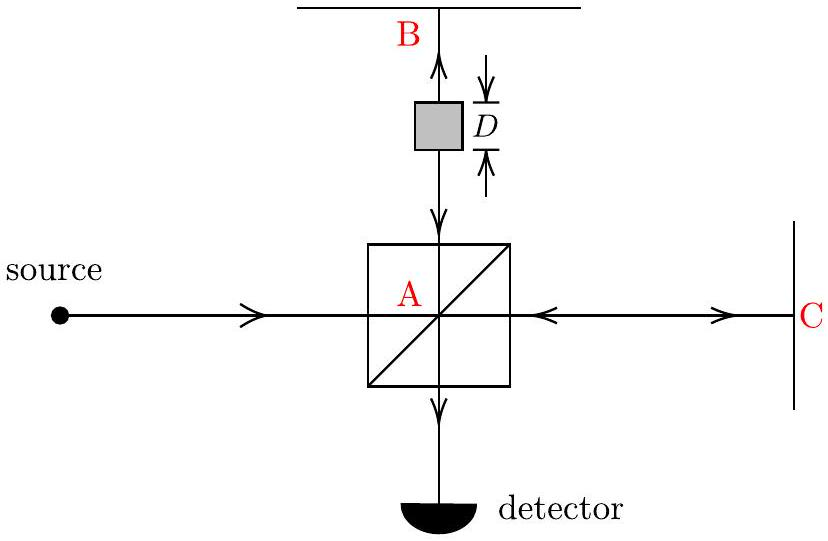

6. In this question, we will consider variations of the Michelson-Morley interferometer.
(a) In the interferometer below, an ideal beam splitter is placed at $A$ while two perfectly reflective mirrors are placed at $B$ and $C$, with $|A B|$ and $|A C|$ being equidistant. To mesaure the refractive index of a gas such as helium, we insert a hollow glass cell of width $D=0.10 \mathrm{~m}$ and negligible thickness into one path of the interferometer and evacuate it. Monochromatic light of wavelength $\lambda$ is shone into the interferometer.

Helium gas with refractive index $n$ is then slowly added to the cell until the pressure reaches atmospheric pressure. As this is done, the intensity of the light at the detector will vary. We then carefully count the number of times the intensity varies from maximum to minimum and back to maximum. If $\lambda=633 \mathrm{~nm}$ (from a helium-neon laser) and there are $k=11$ cycles back to maximum intensity, find the numerical value

of $n-1$ at atmospheric pressure. The interferometer is placed in the $x-y$ plane and you may neglect effects of gravity.
(b) Suppose the tiny gas chamber is now moving at speed $v$ from $A$ towards $B$, find the phase difference $|\Delta \phi|$ between the light from the two paths meeting at the detector in terms of the refractive index $n$, wavelength $\lambda$, and other relevant constants.
(c) Now, we consider a different Michelson-Morley interferometer set up in the vertical plane, with the top mirror at $B$ removed. A beam of neutrons, each having mass $m$, is fired from the left. The splitter placed at $A$ causes half of it to take the horizontal path with distance $L$ to a mirror at $C$ and back, while the other half takes the vertical path against gravity to some turning point $B^{\prime}$ and back. The initial kinetic energy of each neutron is $\varepsilon=\alpha m g L$.
By treating the neutrons as non-relativistic de Broglie waves, derive the expression for the phase difference $|\Delta \phi|$ when the two neutron beams meet at the detector in terms of $\alpha, m, g, L$, and $\hbar$. Effects of gravity are not negligible.
(d) Qualitatively sketch the graph of intensity $I$ measured at the detector against $\alpha$ for $0 \leq \alpha \leq 6$ assuming the number of neutrons emitted per unit time is the same.
