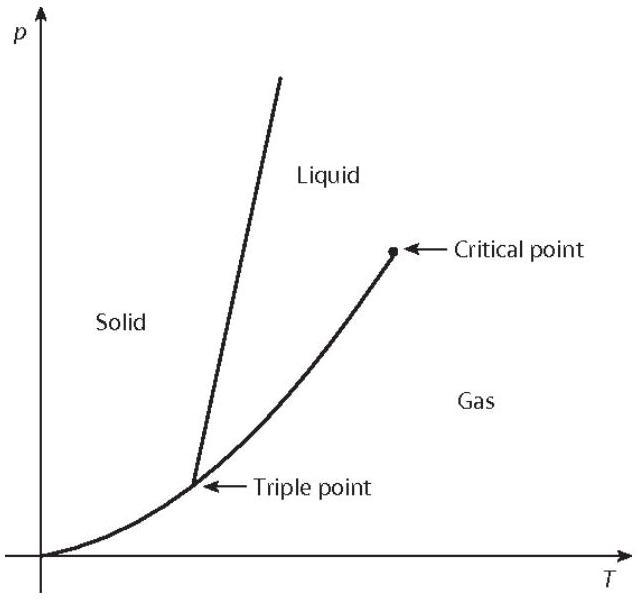

9. The temperature in which a thermodynamic phase transition happens can be plotted against pressure in a $P(T)$ graph. This graph is called a coexistence curve and it is determined by the Clausius-Clapeyron equation:
$$
\frac{d P}{d T}=\frac{L}{T\left(v_{2}-v_{1}\right)}
$$
where $L$ is the latent heat per mole, and $v_{1}$ and $v_{2}$ are the volumes per mole of the material in each of the phases. As an illustration, the coexistence curve of a water is shown below.
(a) First, consider a simple phase transition - a liquid-gas phase transition. You are given that the point $\left(P_{0}, T_{0}\right)$ lies on the coexistence curve. Determine the equation of $P(T)$, making (and justifying) any relevant approximations about liquids and gases. You may assume the latent heat of vaporisation $L$ is temperature-independent. To not confuse the ideal gas constant with the radius (in later parts), you may write the former as $R_{\mathrm{g}}$.

From now on, we shall let $P_{\text {sat }}(T)$ denote the saturation pressure; that is, the pressure that lies on the coexistence curve (the $P(T)$ found previously) for a given temperature. Consider a container held at a fixed external pressure $P_{\text {ext }}$. By definition, ordinary boiling occurs at a temperature $T_{\mathrm{b}}$, whereby

$$
P_{\mathrm{sat}}\left(T_{\mathrm{b}}\right)=P_{\mathrm{ext}}
$$

In the following parts, we shall study the dynamics of nucleation, referring to the initial formation of a microscopic vapour bubble inside a liquid.
For the following parts, assume that:

i. The liquid and vapour are both at a temperature $T$.
ii. The vapour inside the microscopic bubbles can be treated as having a pressure $P_{\text {sat }}(T)$.
iii. The surrounding bulk liquid is at a constant pressure $P_{\text {ext }}$.
iv. The surface tension $\sigma$ is constant.
v. Gravity can be neglected for pressure variations in the liquid.
vi. The formation of bubbles is a fully reversible process.

We define the driving pressure for vapour-bubble formation as follows:

$$
\Delta P(T)=P_{\mathrm{sat}}(T)-P_{\mathrm{ext}} \quad\left(T>T_{\mathrm{b}}\right)
$$

(b) For the case $T>T_{\mathrm{b}}$, vapour bubbles can form in the liquid. Gibbs free-energy is a thermodynamic potential measuring the maximum reversible work by a thermodynamic system at constant pressure and temperature; we can use it to determine the spontaneity and energetic feasibility of phase transitions. The Gibbs free-energy can be given by
$$
G_{\mathrm{b}}(R)=U+P V-T S
$$
where $U$ is internal energy, $P$ is pressure, $V$ is volume and $S$ is entropy. Find an expression for the free-energy change $\Delta G_{\mathrm{b}}(R)$ when forming a spherical bubble of vapour of radius $R$. You must explain the physical meaning and the signs of each term in your answer.
(c) Determine expressions for the critical radius $R_{\mathrm{c}, \mathrm{b}}$ where $\Delta G_{\mathrm{b}}(R)$ is maximum, and the corresponding nucleation barrier height (maximum free-energy barrier) $\Delta G_{\mathrm{b}}^{*}$.

Continue working in the regime $T>T_{\mathrm{b}}$, so that bubble nucleation is relevant. You may treat $\Delta P$ as roughly constant during a short time interval. A vapour bubble of radius $R(t)$ expands in an incompressible, ideal liquid of mass density $\rho$. Neglect viscous and dissipative effects, and assume that the container of liquid is large.
Assume the liquid around the bubble to be incompressible, and that the resulting liquid velocity field $\mathbf{u}=u(r, t) \hat{\mathbf{r}}$ is purely radial, where $r>R(t)$ is the distance from the center of the bubble, outside the bubble.

(d) Derive an expression for $u(r, t)$, in terms of $R(t), \dot{R}(t)$ and $r$. Show your working clearly.
Hint: If needed, the continuity equation is $\nabla \cdot \mathbf{v}=0$, where $\mathbf{v}$ is the velocity field of the liquid. For a purely radial vector field $\mathbf{v}=v_{r} \hat{\mathbf{r}}$, the divergence in spherical coordinates is given by $\nabla \cdot \mathbf{v}=\frac{1}{r^{2}} \frac{\partial}{\partial r}\left(r^{2} v_{r}\right)$.
(e) Hence, show that
$$
\rho f_{1}(R, \dot{R}, \ddot{R})=\Delta P-f_{2}(R)
$$
for some functions $f_{1}(R, \dot{R}, \ddot{R})$ and $f_{2}(R)$ that depend on the given parameters. Find the functions $f_{1}(R, \dot{R}, \ddot{R})$ and $f_{2}(R)$.

Let $T_{\mathrm{R}}$ be the temperature where a bubble of radius $R$ remains in mechanical equilibrium, under the conditions and assumptions of the previous parts. Clearly, $T_{\mathrm{R}} \neq T_{\mathrm{b}}$. We denote $\Delta T=T_{\mathrm{R}}-T_{\mathrm{b}}$.

(f) Assuming that $\Delta T \ll T_{\mathrm{b}}$, determine an expression for $\Delta T$.
