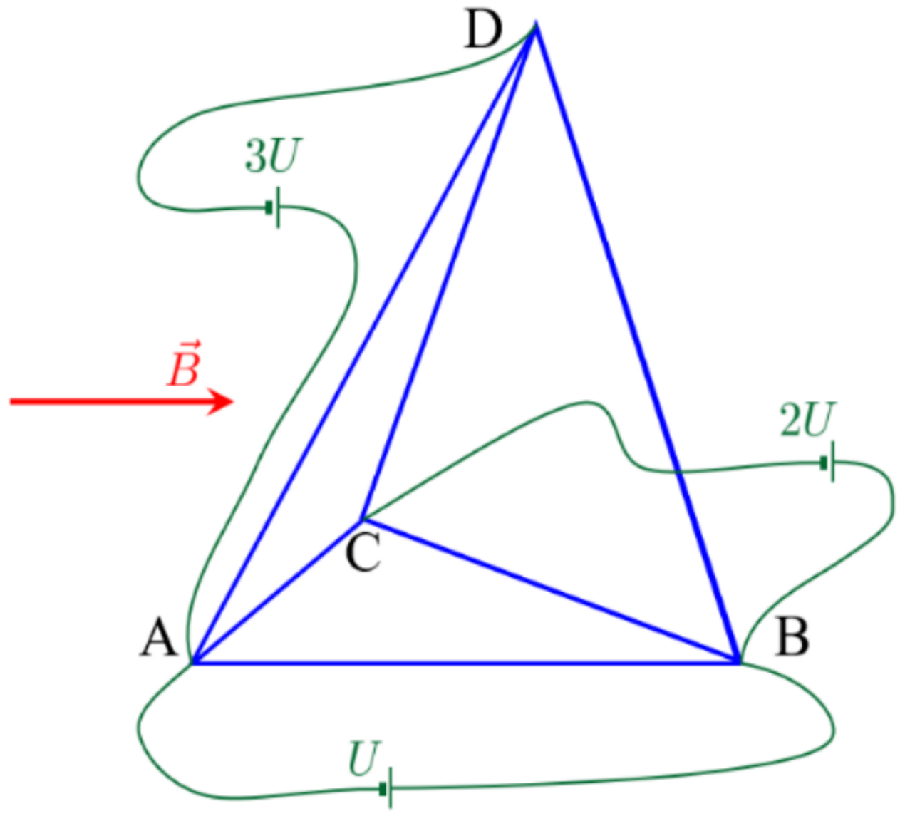

A regular tetrahedron ABCD with edge length $l$ is made of uniform wire so that the resistance of each edge is $R$. Between points A and B an ideal source with voltage $U$ is connected, between points B and C another source with a voltage of $2U$, and between points A and D a third source with a voltage of $3U$. The tetrahedron is located in a homogeneous magnetic field with induction vector $\vec{B}$ directed along the edge AB.

1.1 Find resistance between two vertices

1.2 Find current in each edge

1.3 Prove that force acting on a tetrahedron equals to the Amper force acting on a straight conductor connecting the points connected to a source of voltage (If we only consider one U at a time)

1.4 Find force acting on a tetrahedron from the side of homogeneous magnetic field. You may use the result of 1.3 even if you didn't do it
