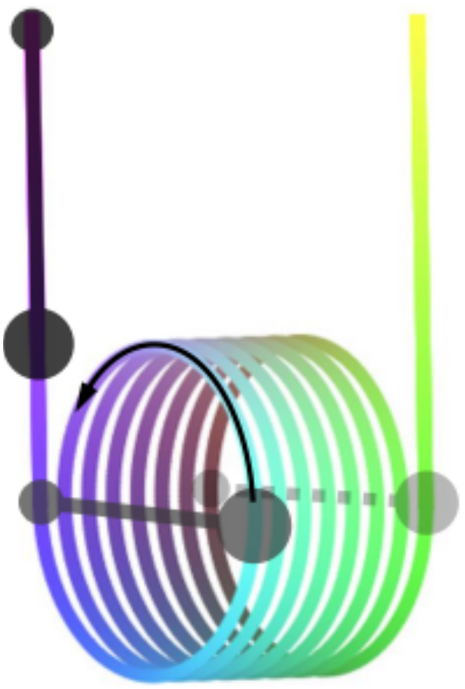

The figure shows a rigid wire in the form of a fragment of a helical line with its vertical ends straightened. Two balls are attached to the wire, hinged by a light rod of the longest possible length, which allows this "dumbbell" to move along the helical line. In the initial position, the lower ball (the larger one in the figure) was held at the level of the upper parts of the wire turns. The balls are released. The forces of friction, air resistance, and the size of the balls are neglected. The acceleration of free fall $g = 9.8\,m/s^2$, radius of the helical line $R = 20\,cm$. The figure is schematic, but the number of turns on it is accurate.

4.1 Part 1

Find the time of movement of this "dumbbell" along the arcs of the helical line, i.e. from one extreme horizontal position of the rod to the other (see Fig. Figure). Keep in mind that the masses of the balls are the same, and the distance between the turns of the spiral line is much smaller than its radius.

Next, consider the case where the larger ball has three times the mass of the smaller one, and the distance between the turns is $h = 18\,cm$. Remember to take into account the corresponding change in the length of the "dumbbell" due to this distance.

4.2 Part 2

To what maximum height will the larger ball rise after passing through a spiral line?
(Note from the translator: don't forget that the dumbell may not be completely vertical in the end)

4.3 Part 3

Due to the small frictional and drag forces, the motion of the balls gradually slows down. Determine the period of small oscillations of the balls over after a long period of time.
(Note from the translator: there are two possible positions where it will oscillate, one between two turns, one on the edge of a turn and a vertical line)

Note that the distance between the turns $h = 18\ \mathrm{cm}$ is measured along the axis of symmetry of the helical line, and the radius $R$ is measured in the perpendicular direction.
