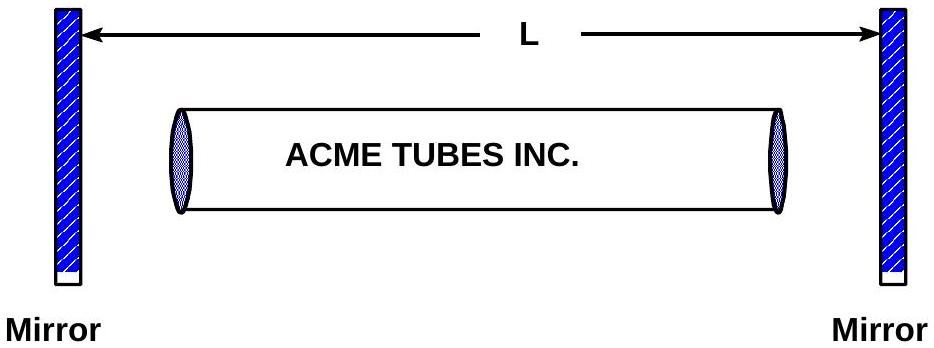

A1. A laser may be constructed from two main components: a resonant cavity of length $L$ formed from two highly reflecting flat mirrors, and a gas-filled tube that emits light when excited by a high voltage. Placed inside the otherwise evacuated cavity, the tube creates light which bounces back and forth between the mirrors such that standing light waves are produced within the cavity. (The radiation can be let out through a tiny window in one of the mirrors, but in this problem we are interested in what goes inside the cavity.)

$(\mathbf{a}, \mathbf{5})$ What are the frequencies possible for the standing light waves in the cavity? Express your answer in terms of the cavity length $L$ and the speed of light in vacuum, $c$.
$(\mathbf{b}, 5)$ Suppose the plasma tube emits light of a pure frequency $f_{o}=5 \times 10^{14} \mathrm{~Hz}$. Which standing wave mode (specified by an integer $n_{o}$ ) is excited in the cavity if $L=1.5 \mathrm{~m}$ ?
$(\mathbf{c}, \mathbf{5})$ Suppose the plasma tube emits light not of a pure frequency, but emits light having all the frequencies in the range $f_{o} \pm \Delta f$, where $f_{o}=5 \times 10^{14} \mathrm{~Hz}$, and $\Delta f=1 \times 10^{9} \mathrm{~Hz}$. How many standing wave modes are excited in the cavity if $L=1.5 \mathrm{~m}$ ?
$(\mathbf{d}, \mathbf{5})$ Using the $f_{o}$ and $\Delta f$ of part (c), what is the largest value of $L$ such that only one standing wave mode will be excited in the cavity, thereby giving the laser only one output frequency?

(Adapted from A.P. French, Vibrations and Waves, Norton, NY, 1971).
