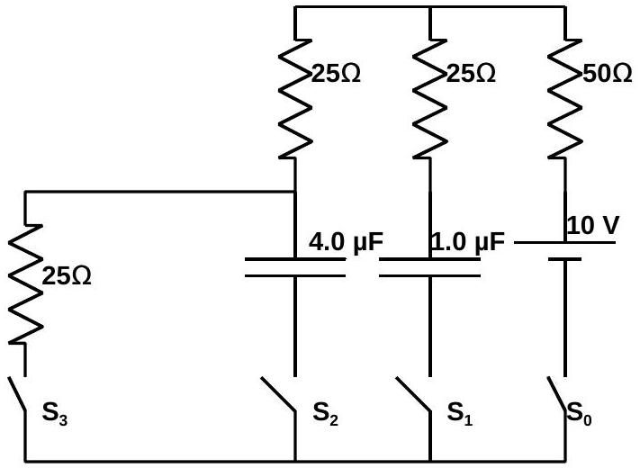

A3. The circuit shown consists of:
a 10 volt battery, a $1.0 \mu \mathrm{~F}$ capacitor, a $4.0 \mu \mathrm{~F}$ capacitor, a $50 \Omega$ resistor, three $25 \Omega$ resistors, and four switches, labeled $\mathrm{S}_{0}, \mathrm{~S}_{1}, \mathrm{~S}_{2}, \mathrm{~S}_{3}$. All switches are initially open. In all cases assume that the circuit is completely insulated from its surroundings.

$(\mathbf{a}, \mathbf{5})$ Switches $\mathrm{S}_{\mathrm{o}}, \mathrm{S}_{1}, \mathrm{~S}_{2}$ are closed. Switch $\mathrm{S}_{3}$ remains open. After a very long time, what is the charge on each capacitor?
$(\mathbf{b}, \mathbf{5})$ Switch $\mathrm{S}_{3}$ is also closed, so that all four switches are closed. After a very long time, what is the charge on each capacitor?
$(\mathbf{c}, 5)$ Switches $\mathrm{S}_{\mathrm{o}}$ and $\mathrm{S}_{3}$ are opened simultaneously. Switches $\mathrm{S}_{1}$ and $\mathrm{S}_{2}$ are left closed. After a very long time, what is the charge on each capacitor?
$(\mathbf{d}, \mathbf{5})$ Switches $\mathrm{S}_{2}$ and $\mathrm{S}_{3}$ are opened. Switches $\mathrm{S}_{\mathrm{o}}$ and $\mathrm{S}_{1}$ are closed. After a very long time has passed you insert into the $1.0 \mu \mathrm{~F}$ capacitor a slab of dielectric material. After the dielectric is inserted, it totally fills the region between the plates. The material's dielectric constant is 3.0. What is the total work done in inserting the dielectric (that it, what is the net work done by you and the battery)?
