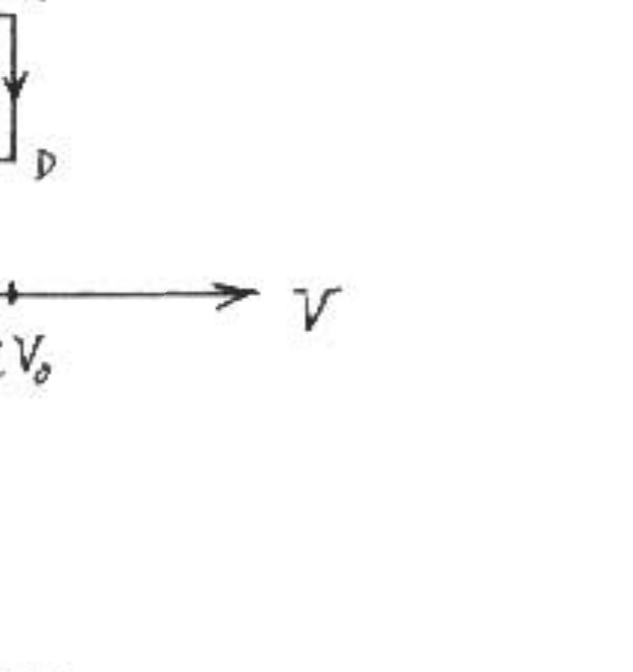

A1. ( 25 points) Two moles of monatomic ideal gas are taken through the reversible cycle shown on the $P I^{\prime}$ diagram below. The cycle forms a rectangle, starting from State A at ( $V_{0}, P_{0}$ ), to State B at $\left(V_{0}, 2 P_{0}\right)$, to State C at $\left(2 V_{0}, 2 P_{0}\right)$, to State D at $\left(2 V_{0}, P_{0}\right)$, and back to State A . Express all answers to the following questions in terms of $V_{s}, P_{0}$, and the ideal gas constant $R$.
(a. 5 points) Calculate the net work done by the gas during the cycle.
(b. 5) Calculate the net heat transferred between the gas and the surroundings during one cycle.
(c. 10) Calculate cycle's thermodynamic efficiency when operating as an engine.
(d. 5) Calculate the change in entropy of the gas as the system goes from State A to State D .

