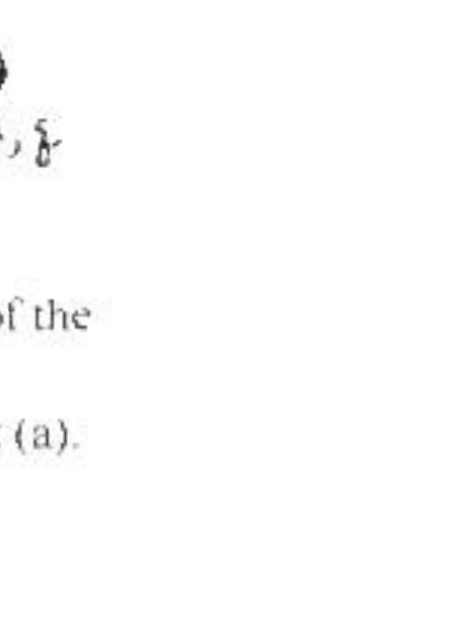

A2. ( 25 points) Two uniformly charged balls each have mass $m$ and carry electric charge $q$. Each ball is tied to a string of length $L$ and negligible mass. The other ends of the strings are tied to a hook in the ceiling. When the balls are in equilibrium the strings stand apart with the angle $2 \theta_{c}$ between them.
(a. 7) Find an expression for $\theta_{c}$ in terms of the given quantities and known constants. Neglect the

gravitational force which the balls exert on each other
(b. 6) Now let both balls be displaced an additional angle $\delta \ll 1$. Find the magnitude of the new electric force $F^{\prime}$ which one ball exerts on the other one. In particular, show that $F^{\prime}=F_{\Delta}\left(1-2 \delta \cot \theta_{b}\right)$ where $F_{b}$ is the electric force's magnitude for the situation of part (a). Along with the binomial expansion, the following approximations may be useful:

$$
\begin{aligned}
& \sin \left(\theta_{a}+\delta\right)=\sin \theta_{a}+\delta \cos \theta_{\ldots} \\
& \cos \left(\theta_{o}+\delta\right)=\cos \theta_{o}-\delta \sin \theta_{o}
\end{aligned}
$$

( $\mathrm{c}, 10$ ) When the balls are released from the angle $\theta_{\omega}+\delta$, each ball undergoes an oscillation about its equilibrium position (assume that the balls move only in the original plane of the two strings). Find an expression for the period $T$ of this oscillation in terms of given quantities and known constants. Neglect air resistance.
(d. 2) Evaluate $T / T_{0}$ for $\theta_{0}=45$ degrees, where $T_{0}$ is the period of a simple pendulum of length $L$.
