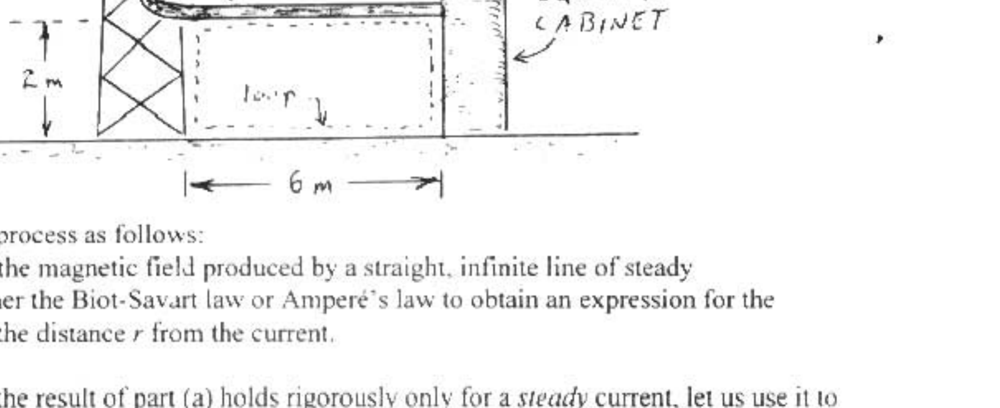

A4. (25) This problem describes a real situation once faced by Federal Aviation Administration engineers. In Florida, where there are frequent thunderstorms, the FAA experienced a large number of communications equipment failures. Suspecting lightning strikes, a power recording monitor was installed at one Florida site. After carefully studying the problem, the engineers concluded that the failures were the result of inductive coupling of energy into the communications system. They determined that a conducting loop (with dimensions of about 2 meters by 6 meters) was formed by the steel tower, the copper microwave waveguide, the steel equipment cabinet, and the ground (see sketch). Using typical figures for the rise time of electric current in a lightning bolt, one can estimate that significant voltages would be induced in this loop, even by a lighting strike several kilometers away

Let us model the process as follows:
(a, 8) Begin with the magnetic field produced by a straight, infinite line of steady current $I$. Use either the Biot-Savart law or Ampere's law to obtain an expression for the magnetic field at the distance $r$ from the current.
(b. 10) Although the result of part (a) holds rigorously only for a steady current, let us use it to estimate the time-dependent magnetic field produced by a lightning bolt. Let us model the lightning bolt as a straight, vertical, infinite line of current that rises linearly from zero to $1 \times 10^{6} \mathrm{~A}$ in $5 \times 10^{-5} \mathrm{~s}$. Let the lightning bolt strike one kilometer from the tower. Find the emf induced in the conducting loop while the lightning current increases. Describe any other approximations you make besides the ones we have already mentioned.
(c, 7) Suppose the conducting loop described above has a resistance of 50 Ohms. Inside the cabinet there is a solid state device that can survive a maximum current of $1 / 2 \mathrm{~A}$. Could this device be damaged by the lightning strike described in part (b)?
(This problem adapted from the Structures and Interactions in Nature model curriculum of the Introductory University Physics Project. Special thanks to Paul Griffith of the FAA.)
