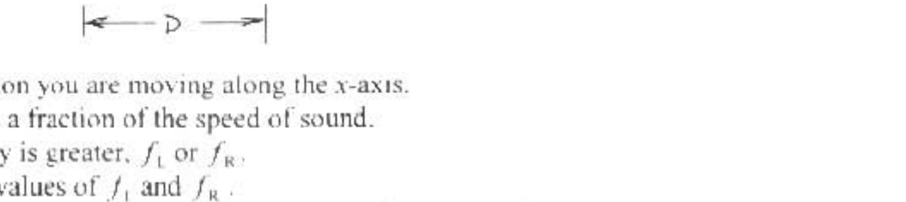

B1. (40) Two sirens located on the $x$-avis are separated by a certain distance $D$. As heard by an observer at rest, $f_{1}$ denotes the frequency emitted by the left-hand siren, and $f_{\mathrm{R}}$ denotes the frequency emitted by the right-hand siren. You are moving with constant velocity at speed ", along the $x$-axis, and record the following observations:

When you are on the right side of both sirens, you hear a beat frequency of 1.01 Hz . When you are on the left of both sirens. you hear a beat frequency of 0.99 Hz . When you are befween the sirens, the beat frequency is cero.

(3.5) Determine in which direction you are moving along the $x$-axis.
(b. 10) Evaluate your speed $v_{\mathrm{u}}$ as a fraction of the speed of sound.
(c. 5) Determine which frequency is greater, $f_{\mathrm{L}}$ or $f_{\mathrm{R}}$.
(d. 10) Determine the numerical values of $f_{1}$ and $f_{R}$.
(e. 10) Suppose you stop moving, and the siren that emits sound of frequency $f_{\mathrm{L}}$ is taken aboard a belicopter. The helicopter hovers with zero velocity above you. The siren (assumed to be battery-powered) is dropped from the helicopter. In the case of negligible air resistance, sketch a graph of frequency as a function of time, that describes the frequency you hear from this falling siren. [If you did not obtain a value for $f_{\llcorner }$in part (d), use 50 Hz .] Take the speed of sound to be $343 \mathrm{~m} / \mathrm{s}$. The siren falls for 30 seconds before striking the ground beside you.
