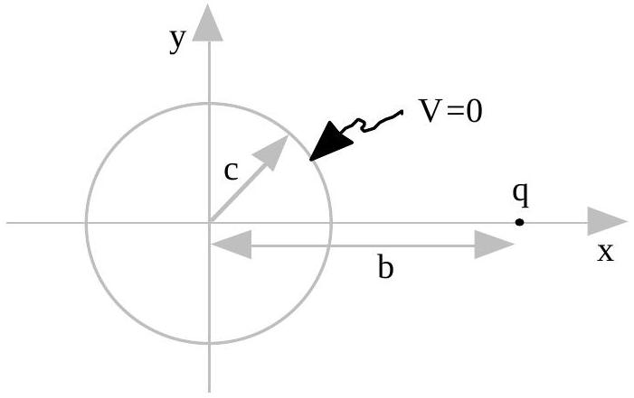
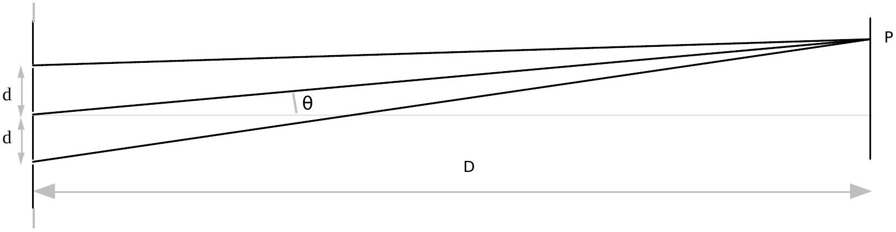

A2. (20) Assume the electric potential to be zero at infinity. A charge $q$ is located on the x -axis at $x=b$. One additional charge is placed elsewhere on the xaxis so that all points a distance $c$ from the origin have zero total electric potential. What is that additional charge and where is it located? Express your answer in terms of $q, c$, and $b$.

