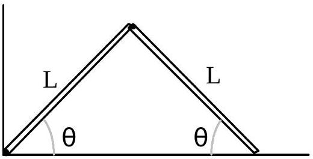

B1. Consider two uniform rods each of mass $M$ and length $L$, hinged together to form an upside-down "vee" shape whose angle can vary. The rods are released from rest when their angle $\theta$ with the horizontal is 45º. All hinges are frictionless and have negligible mass.

Case 1

Case 1: The left end is also hinged at a fixed point at the bottom. The right-hand end of the configuration slides on the horizontal surface without friction.

Case 2: Both ends can slide frictionlessly along the surface.
(The sub-parts of this problem may be worked in any order.)

(10) a. Find the upward force $F_{N}$ that the horizontal surface exerts on the right hand side of the Case 1 rods just after release, when $\theta=45^{\circ}$.
(10) b. Repeat Part (a) for Case 2.
(10) c. Find the angular velocity of the Case 1 rods as a function of $\theta . \quad 0<\theta<45^{\circ}$
(10) d. Repeat Part (c) for the configuration of Case 2.
