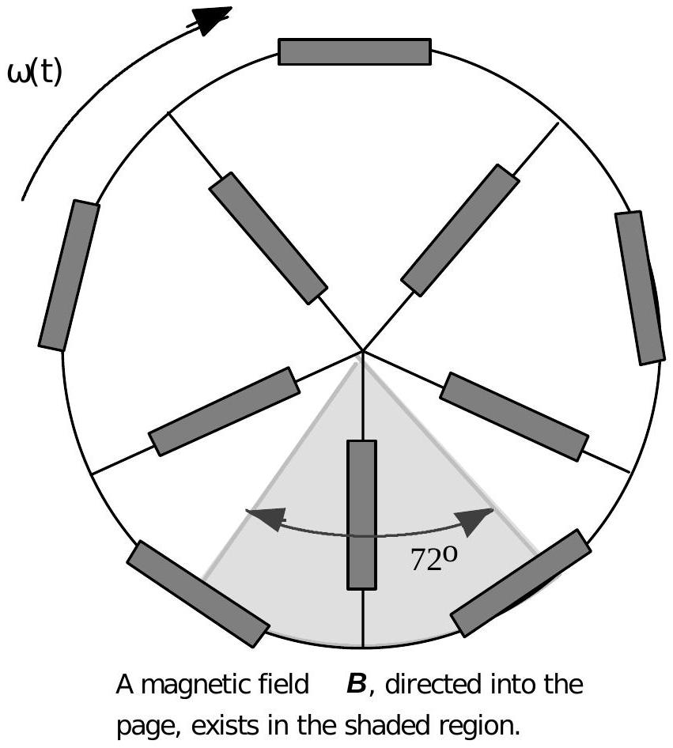

B2. (40) Consider the following model of the effect of eddy currents. A rigid wheel, shown in the diagram to the right, consists of ten identical resistors each having resistance $R$. Five of the resistors are equally spaced around a circumference of radius $r_{o}$. The other five resistors form spokes of the wheel with an angle of $72^{0}=2 \pi / 5$ radians between adjacent spokes. Assume the resistors have negligible thickness and follow the curvature of the circumference. The wheel rotates about a fixed axis through a circular-sector-wedgeshaped uniform magnetic field $\boldsymbol{B}$. The sides of the wedge have a length $r_{o}$ and the angle of the wedge is 72°. The vertex of the wedge coincides with the axis of the rotating wheel. The wheel's moment of inertia about its center of mass is $I_{o}$. At time $t$, the wheel's

angular velocity is $\omega(t)$.
(15) a. Draw a diagram of the wheel which shows the direction and magnitude of the electric current in each of the ten resistors. Express all currents on the diagram as a multiple of the smallest current $I$. What is $I$ ?
(5) b. Find the total power resistively dissipated by the wheel.
(10) c. Find the angular acceleration of wheel and indicate its direction.
(10) d. Now suppose there are nine equiangular $40^{\circ}=2 \pi / 9$ radian sectors and eighteen identical resistors each having resistance R. Nine resistors are on the spokes and nine are on the circumference between each pair of spokes. The angle of the magnetic field wedge is also reduced to 40°. Repeat Part (a) for this eighteen resistor case.
(contributed by Leaf Turner)
The 1999 Semi-Final Examination questions were written by the coaches of the United States Physics Team. The coaches are: Academic Director, Dr. Mary Mogge - Professor of Physics at California State Polytechnic University, Pomona, CA; Senior Coach, Dr. Leaf Turner - Physicist in the Theoretical Division of Los Alamos National Laboratory, Los Alamos, NM; Dr. Warren Turner - Physics Teacher at St. Paul's School, Concord, NH. The coaches would also like to thank former academic director, Dr. Larry Kirkpatrick for his many helpful comments.
