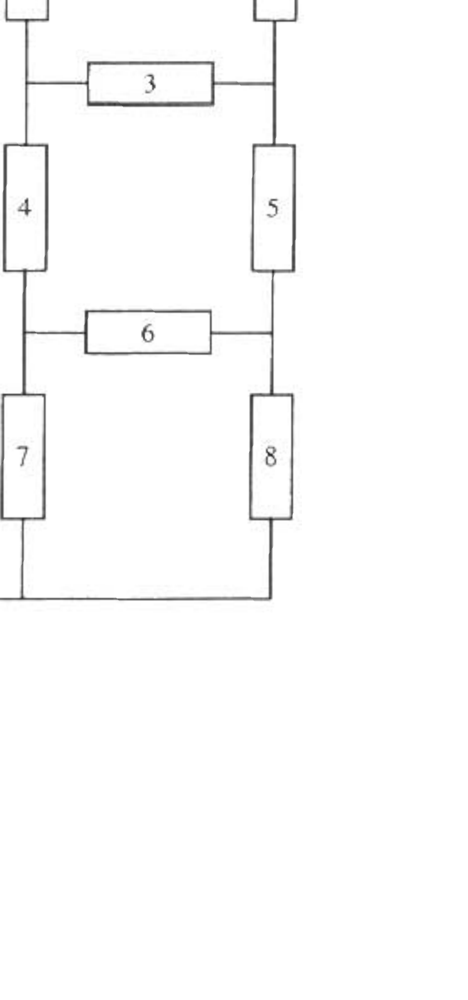

A2. The circuit diagrammed at the right consists of a $6.0-\mathrm{V}$ power supply and eight $12.0-\Omega$ resistors. labeled I - 8 .
(5) a. What is the equivalent resistance of the circuit?
(5) b. What is the current in each resistor? Please use $i_{j}$ to denote the current in resistor $j$.
(5) c. Resistors I, 5, and 7 are replaced with $4.0-\mu \mathrm{F}$ capacitors. What is the charge on each capacitor after the circuit has been connected for a very long time? Please use $Q_{j}$ to denote the charge on the capacitor in location $j$.
(5) d. The capacitor in location 5 is replaced with a second $6.0-\mathrm{V}$ power supply (positive end closest to resistor 3 and negative end closest to resistor 6). What is the current through each resistor after the circuit has been connected for a very long time? Please use $l$, to denote the current in resistor $j$. In this part $2,3,4,6$, and 8 denote 12.0 - $\Omega$ resistors. 1 and 7 denote $4.0-\mu \mathrm{F}$ capacitors, and 5 denotes a $6.0-\mathrm{V}$ power supply.

