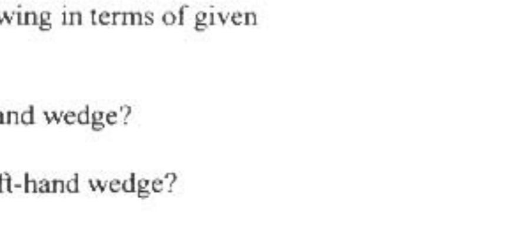

A4. Two movable wedges of mass $M$ meet the horizontal plane smoothly. They are free to slide without friction on the plane. See accompanying diagram. A coin of mass $m$ is released from rest at the height $h$ and slides

down the left hand wedge. Assume that the coin always slides without friction. Express your answers to the following in terms of given quantities and known constants.
(10) a. What is the maximum height the coin will rise on the right-hand wedge?
(10) b. For what minimum mass $M$ will the coin again contact the left-hand wedge?

## 2000 Semi-Final Exam

## Part B
