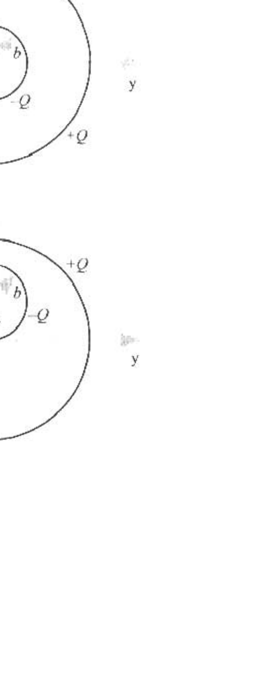

B1. A hollow spherical shell of radius $b$ and negligible thickness is constructed out of insulating material with total charge $-Q$. A second similar shell has radius $c$ where $c>2 b$ and total charge $+Q$. Each shell has its charge distributed uniformly over its surface. Assume the electrostatic potential is zero at infinity. As shown at the right, the symbols I, II, and III may be used to denote the regions inside the smaller shell, between the shells, and outside the larger shell, respectively. Express your answers to the following in terms of given quantities and known constants. You may use either spherical or Cartesian coordinates.

The spherical shells are concentric as shown in Figure a. at the right.
(10) a. Find the electrostatic field in regions I, II. and III as a function of position.
(10) b. Find the electrostatic potential in regions I, II, and III as a function of position.

The spherical shells are not concentric as shown in Figure b at the right. The inner shell is shifted in the positive $z$ direction a distance $b$ equal to its radius.
(10) c. Find the electrostatic field in regions I, II, and III as a function of position.
(10) d. Find the electrostatic potential in regions I, II, and III as a function of position.

