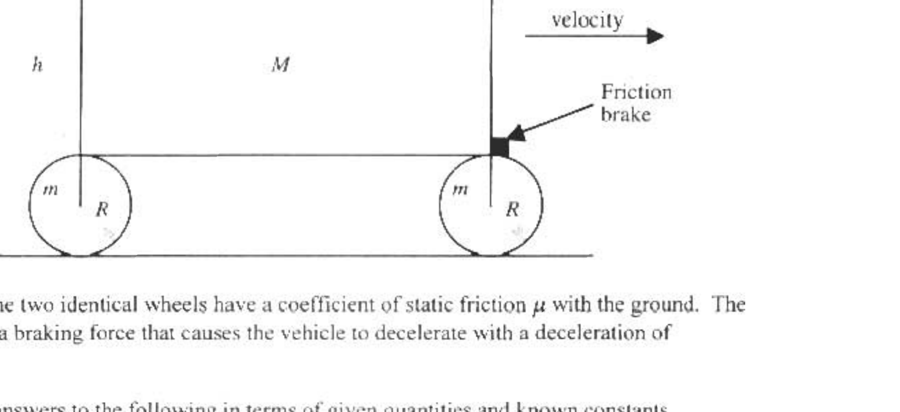

B2. We shall model a car as a uniform rectangular block of length $L$ and height $h$ with mass $M$ that has struts of length $R$ that rest on the frictionless axles of two wheels of radius $R$, one front wheel and one rear wheel. Each wheel has a mass $m$ and a uniform mass density. The driver can exert a friction force at the top of the front wheel to slow down the car. See the diagram below.

Assume that the two identical wheels have a coefficient of static friction $\mu$ with the ground. The driver applies a braking force that causes the vehicle to decelerate with a deceleration of magnitude $a$.

Express your answers to the following in terms of given quantities and known constants.
(4) a. Find $f_{R}$ the frictional force of the ground on the rear wheel.
(4) b. Find $F_{C R}$ the horizontal component of the force exerted by the car on the axle of the rear wheel.
(4) c. Find $f_{F}$ the frictional force of the ground on the front wheel.
(4) d. Find $f_{B}$ the force of the brake that is applied to the front wheel.
(4) e. Find $F_{C F}$ the horizontal component of the force exerted by the car on the axle of the front wheel.
(8) f. Find $n_{F}$ and $n_{R}$ the normal forces exerted by the ground on the front and rear wheels.
(4) g. For each wheel, find the maximum possible deceleration of the car before that wheel starts to slip.

If $L=2.50 \mathrm{~m}, h=1.50 \mathrm{~m}, R=0.300 \mathrm{~m}, M=6000 \mathrm{~kg}, m=200 \mathrm{~kg}, \mu=0.600$,
(4) h. Numerically evaluate the magnitude of the maximum possible deceleration of the car in terms of the acceleration of gravity, g .
(4) i. Numerically evaluate the ratio of the normal force of the ground on the front wheel to that on the rear wheel at this maximum deceleration.
