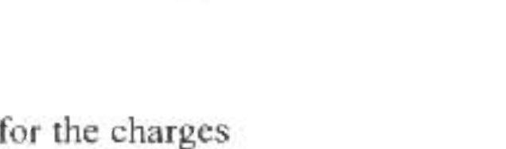
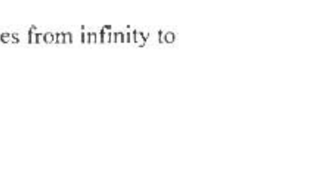

A2. Point charges $q_{1}, q_{2}$, and $Q$ are located at three corners of an $r_{1}$ by $r_{2}$ rectangle as shown in the diagram to the

right.
(10) a. Write a general expression for the electrostatic field at the point marked X in the diagram. Define any quantities you introduce.

$H$

(5) b. For what values of $q_{1}$ and $q_{2}$ (expressed in terms of
$\_\_\_\_$
䚉

$r_{1}$

$r_{1}, r_{2}$, and $Q$ ) does the field at X vanish?
(5) c. Write a general expression for the electrostatic potential at X and evaluate it for the charges found in Part b. Assume the potential vanishes an infinite distance from the charges.
(5) d. How much total work is done by the electric force as a fourth charge $q_{4}$ moves from infinity to the point marked X ? Assume $q_{1}$ and $q_{2}$ are the charges found in Part b .
