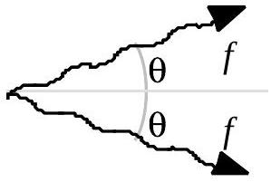

A2. A particle decays into two photons which are both observed to have frequency $f$, one moving at an angle $\theta$ above the positive $x$-axis and the other at an angle of $\theta$ below the positive $x$-axis. See the accompanying diagram. The energy and momentum magnitude of a relativistic particle of mass $m$ and

speed $v$ are:

$$
E=\frac{m c^{2}}{\sqrt{1-(v / c)^{2}}}
$$

$$
p=\frac{m v}{\sqrt{1-(v / c)^{2}}}
$$

(15) a. Find the velocity of the original particle.
(5) b. Find the rest mass of the original particle.
(5) c. What are the frequencies of the decay photons in the rest frame of the particle? What are their directions of travel in this rest frame?

(25) A3. Fundamental quanta of length, time, and mass are the Planck length $\lambda_{\mathrm{P}}$, the Planck time $t_{\mathrm{P}}$, and the Planck mass $m_{\mathrm{P}}$. Use the fact that they depend only on the Newton's gravitational constant $G$, Planck's constant $h$, and speed of light in a vacuum $c$ and no other constant to derive expressions for them and then calculate their numerical values.
