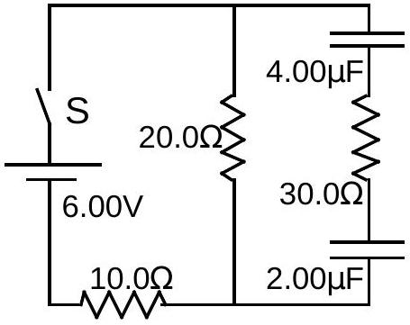

A1. The capacitors in the circuit diagrammed to the right are initially uncharged.
(10) a. What is the current in each resistor immediately after the switch labeled S is closed?

After a very long time, the capacitors are fully charged.
(5) b. What is the current in each resistor at this time?
(10) c. What is the charge on each capacitor?

