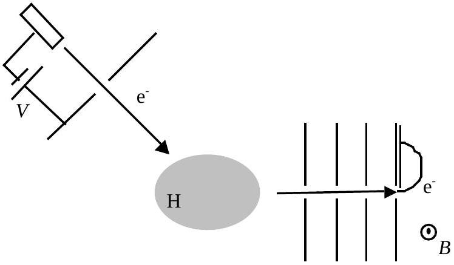
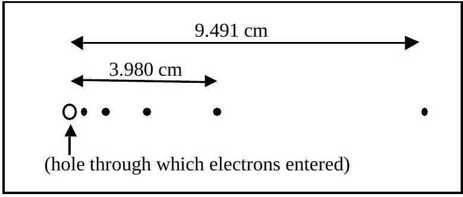

B1. (20) a. In 1913, Niels Bohr first derived a formula for the energy levels of the hydrogen atom. He postulated that the single electron orbited a very massive proton under the influence of the electrostatic force and that the circular electron orbits had quantized angular momentum

$$
L=n \hbar=n \frac{h}{2 \pi}
$$

where $n=1,2,3, \ldots$ and $h$ is Planck's constant. These postulates gave rise to discrete values of the electron's total energy $E_{n}$. Derive these Bohr Model energy levels. Express your answer in terms of Coulomb's constant $k$, the electron mass $m$, the electron charge $e, \hbar$, and $n$. If done correctly, your answer should evaluate to

$$
E_{n}=\frac{2.18 \times 10^{-18} \mathrm{~J}}{n^{2}}=\frac{13.6 \mathrm{eV}}{n^{2}} .
$$

b. In a hypothetical modern day experiment, electrons are accelerated from rest through a potential $V$ into a cloud of cold atomic hydrogen (Figure 1-1). A series of plates with aligned holes select a beam of scattered electrons moving perpendicular to the plates. Immediately beyond the final plate, the electrons enter a uniform magnetic field $B$ perpendicular to the beam; they curve and strike a piece of film mounted on the final plate.

Figure 1-1

Figure 1-2

When the film is developed, a series of spots is observed (Figure 1-2). The distances between the hole and the two most distant spots are measured. You may assume that the film is large enough to have intercepted all of the electrons, i.e. that there are no spots farther from the hole than those shown. The number of spots shown is not necessarily accurate.

Make the approximation that the mass of the hydrogen atom is much larger than the mass of the electron. Assume that each electron scatters off only one atom, which is initially in the ground state (lowest energy state) and has negligible thermal velocity.

Determine:

(10) i. The magnitude of the magnetic field $B$.
(10) ii. The magnitude of the accelerating potential $V$.
(10) iii. The total number of spots on the film.
