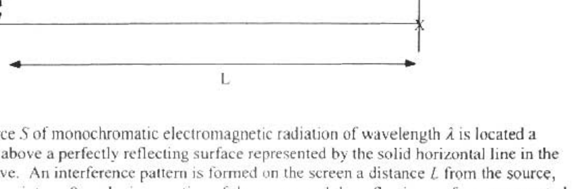
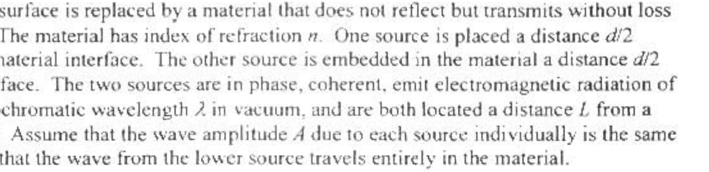

A3. A plane wave traveling in the positive $z$-direction can be described by the following wavefunction: $\psi(z, t)=A \sin (k z-\omega t+\phi)$, where $A$ (the amplitude) and $\phi$ are constants, $k=\frac{2 \pi}{\lambda}, \omega=2 \pi f, f$ is the frequency, and $\lambda$ is the wavelength. The factor $(k z-\omega t+\phi)$ is called the phase of the wave. The following relation may be useful: $\sin \alpha+\sin \beta=2 \cos \left[\frac{1}{2}(\alpha-\beta)\right] \sin \left[\frac{1}{2}(\alpha+\beta)\right]$.

A point source $S$ of monochromatic electromagnetic radiation of wavelength $\hat{\lambda}$ is located a distance $d / 2$ above a perfectly reflecting surface represented by the solid horizontal line in the diagram above. An interference pattern is formed on the screen a distance $L$ from the source, $L \gg d$. The point $y=0$, at the intersection of the screen and the reflecting surface, represented by an X in the diagram, is an interference minimum Point X is on the surface of the material.
(10) a. The first bright band is located at distance $y_{b}$ above point $X$. Find $y_{b}$.

The reflecting surface is replaced by a material that does not reflect but transmits without loss of amplitude. The material has index of refraction $n$. One source is placed a distance $d / 2$ above the air-material interface. The other source is embedded in the material a distance $d / 2$ below the interface. The two sources are in phase, coherent, emit electromagnetic radiation of the same monochromatic wavelength $\lambda$ in vacuum, and are both located a distance $L$ from a screen, $L \gg d$. Assume that the wave amplitude $A$ due to each source individually is the same at point $X$ and that the wave from the lower source travels entirely in the material.
(8) b. What is the resultant wavefunction at point X as a function of time?
(7) c. Let $f_{0}$ denote the maximum intensity reaching point X , which occurs when $\mathrm{n}=1$. Derive an expression for the time averaged intensity of the electromagnetic radiation at point $X$ as a function of $n, H_{1}, L$, and $\nu$.
