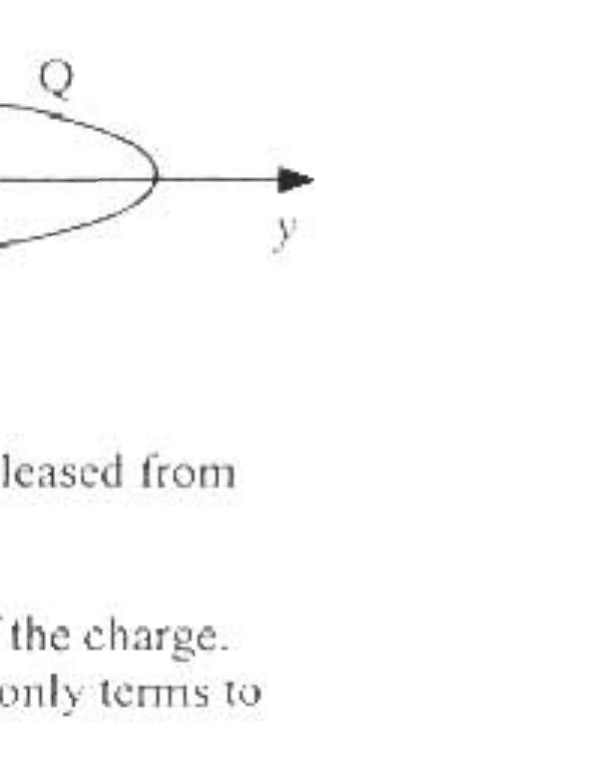
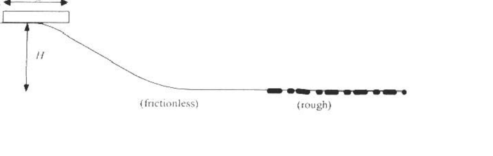

B1. A length of wire is formed into a ring of radius $b$ and total charge $Q$ that is distributed uniformly around the ring. The ring is in the $x-y$ plane and centered on the origin as shown in the accompanying diagram. $i, \hat{j}$, and $k$ are unit vectors in the $x, y$, and $z$ directions respectively. Assume the potential vanishes at infinity.
(7) a. Find the field at any point on the $z$ axis.
(5) b. Find the potentral at any point on the $z$ axis.

A point charge with mass $m$ and charge $-q$ is placed at $z=z_{0}$ where $z_{0} \ll b$ and released from rest at $t=0$. Ignore any effects due to radiation.
(10) c. Find the potental energy of the system as a function of $z$, the position of the charge. Expand this potential energy function about the origin for $|z| \leq z_{0}$. Keep only terms to lowest non-zero order in 2.
(5) d. Find the speed of the charge as it passes through the origin.
(8) $e$. Find the velocity of the charge as a function of time.

The point charge is removed and the ring is set into rotation about the $z$-axis with angular velocity $\bar{\omega}=\omega \hat{k}$. Ignore any effects due to radiation.
(10) $\int$ Find the magnetic field due to the rotating ring at any point along the $z$-axis.
(5) g. A second point charge with mass $m$ and charge $-q$ is placed at $z-z_{1}$ where $z_{0} \ll b$ and released from rest. What is the magnetic force on the charge as it passes through the origin?

