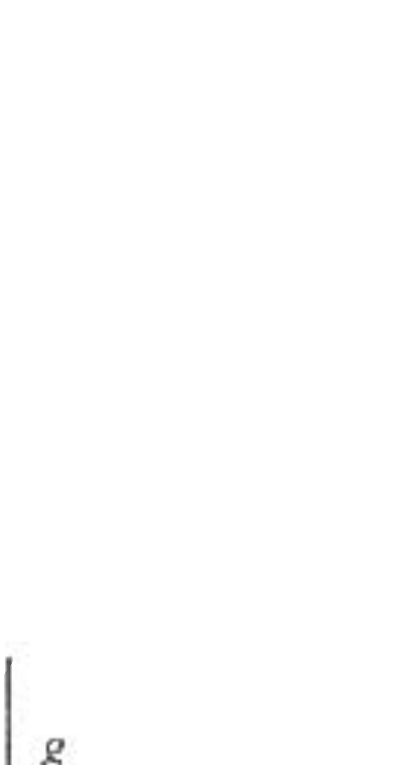

A1. (25) An otherwise uniform disk of radius $R$ has a circular hole of radius $R / 2$ cut out so that the hole touches both the center and the edge of the disk. The disk has a mass $M$ after the hole is cut out. The disk is placed above a wheel so that when the lower wheel rotates, the disk will rotate with a constant angular velocity. The disk is constrained so that it can only move in the up and down direction or rotate freely. If the angular velocity of the disk exceeds a certain value, $\omega_{\text {max }}$. the disk will bounce up and down on the lower wheel. Find the total kinetic energy of the disk when the angular velocity is $\omega_{\text {max }}$. Express your answer in terms of $M, R$, and $g$ (but not in terms of $\omega_{\text {mas }}$ ).

