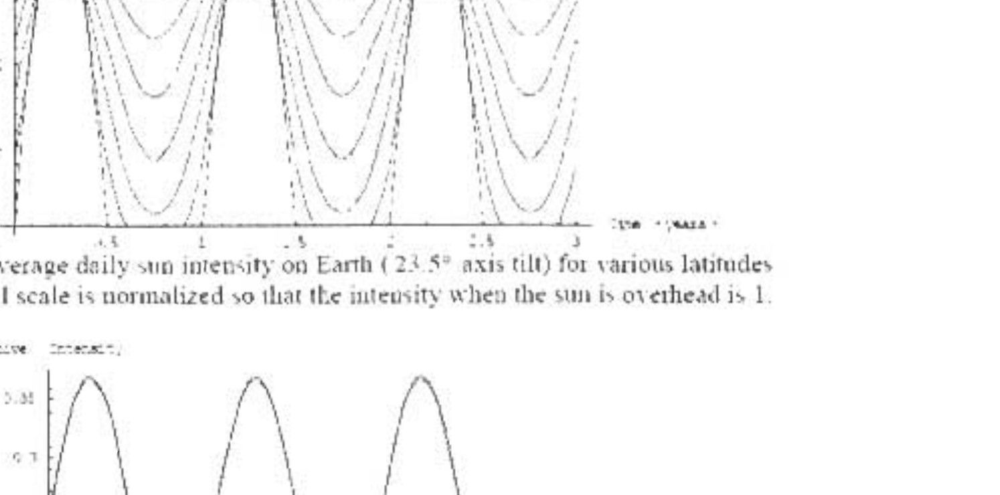
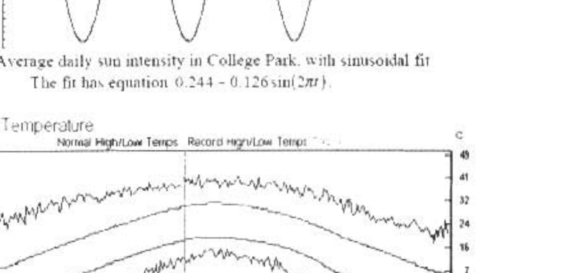
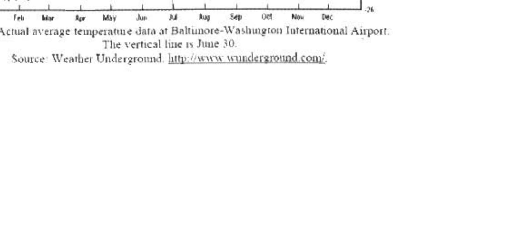

B2. In this problem, we present a simple model of seasonal temperature variation. We ignore temperature and illumination changes between day and night, considering only daily average values. We also ignore all forms of heat transfer other than radiation, including any heat transfer between areas of the surface of the Earth. Finally, we ignore the effects of the amosphere and clouds.

We therefore consider a patch of ground with heat capacity per unit area $c$ and emissivity $E$, illuminated by light of varying intensity $l$. The patch therefore has a varying temperature $T$.
(8) a. Develop an equation relating $T$. $\frac{d T}{d t}, l, c, \varepsilon$, and the Stefan-Boltzmann constant $\sigma$.

Figure 1 shows the yearly variation in average daily sunlight intensity on Earth for various latitudes. The variation is not sinusoidal, but for temperate latitudes, it may be approximated as a sinusoid. In particular, Figure 2 shows the variation in College Park, Maryland (at $39^{\circ} \mathrm{N}$ latitude), together with a good sinusoidal approximation. Therefore, we assume that the intensity has the form $I=I_{0}+I_{1} \sin (\omega t)$. If the annual variation in temperature is small compared to the absolute temperature, we will likewise have $T=T_{0}+T_{1} \sin (\omega t-\phi)$, where by hypothesis $T_{1} \ll T_{0}$.
(14) b. Show that your previous result now implies an equation of the form

$$
A+B \sin (\omega t-\phi)+C \cos (\omega t-\phi)=I_{0}+I_{1} \sin (\omega t)
$$

and provide the expressions for $A, B$, and $C$ in terms of $T_{n}, T_{k}, c, \varepsilon, \sigma$, and $\omega$.
(9) c. Using equation (1), find expressions for $A, B$, and $C$ in terms of $I_{a}, I_{i}$, and $\dot{\phi}$.
(7) d. Combine your results to obtain a simple relationship between the relative amplitude of intensity fluctuations $\frac{I_{1}}{I_{0}}$, the relative amplitude of temperature fluctuations $\frac{T_{1}}{T_{0}}$, and the phase shift $\phi$.
(9) e. Plot on graph paper the predicted difference between summer and winter temperatures in Kelvin vs. the number of months between the summer solstice (day of maximum sunlight intensity) and the hottest day of the year. Use the values for $l_{o}$ and $l_{1}$ given for College Park in Figure 2, and assume a mean temperature of 283 K . Show work indicating the method of your calculations for the numbers plotted on the graph.
(3) f. Actual temperature data for College Park is shown in Figure 3. Does the model provide a reasonable fit to the data? Briefly justify your answer (The summer solstice occurs on June 21.)

## RAPT UNITED STRTES PHYSICS TERM AIP 2006

Figure 1: Average daily sun intensity on Earth ( $23.5^{\circ}$ axis tilt) for various latifudes The vertical scale is normalized so that the intensity when the sum is overhead is 1 .

Figure 2 Average dally sun intensity in College Park. with simusoidal tit The fit has equation 0.244-0.126 $\sin (2 \pi t)$.

Figure 3: Actual average temperatue data at Baltunore-Washugron International Airport. The vertical line is June 30.
Source: Wearher Underground. http://wrow wunderground.com:
