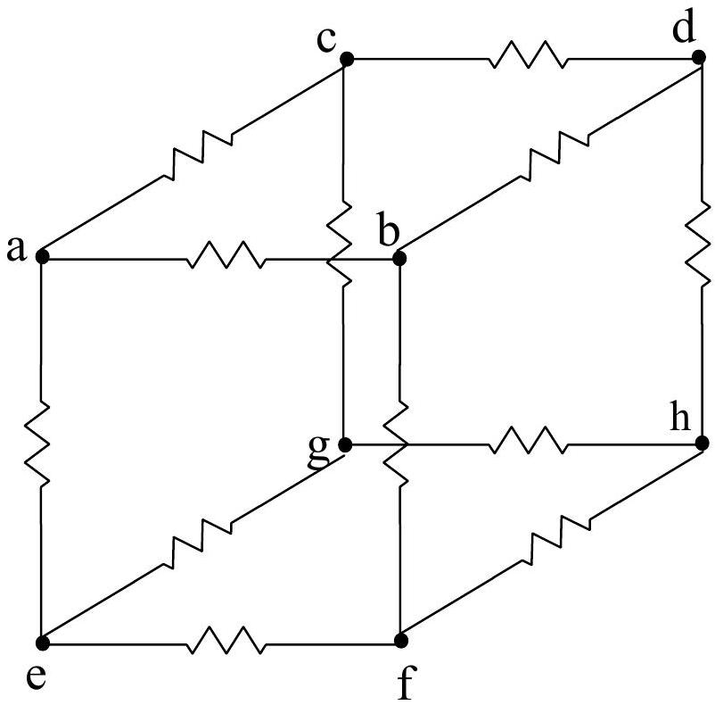

A1. A group of 12 resistors is arranged along the edges of a cube as shown in the diagram below. The vertices of the cube are labeled $a-h$.

a. (13 pts) The resistance between each pair of vertices is as follows:
$$
\begin{aligned}
& R_{a b}=R_{a c}=R_{a e}=3.0 \Omega \\
& R_{c g}=R_{e f}=R_{b d}=8.0 \Omega \\
& R_{c d}=R_{b f}=R_{e g}=12.0 \Omega \\
& R_{d h}=R_{f h}=R_{g h}=1.0 \Omega
\end{aligned}
$$
What is the equivalent resistance between points $a$ and $h$ ?
b. ( 12 pts) The three $12.0 \Omega$ resistors are replaced by identical capacitors. $C_{c d}=C_{b f}=C_{e g}=$ $15.0 \mu \mathrm{~F}$. A 12.0 V battery is attached across points $a$ and $h$ and the circuit is allowed to operate for a long period of time. What is the charge $\left(Q_{c d}, Q_{b f}, Q_{e g}\right)$ on each capacitor after this long period of time?

