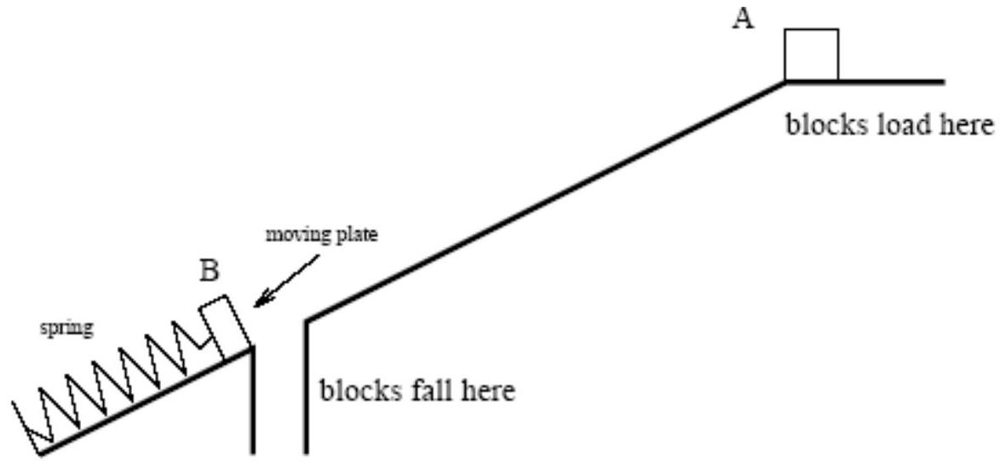
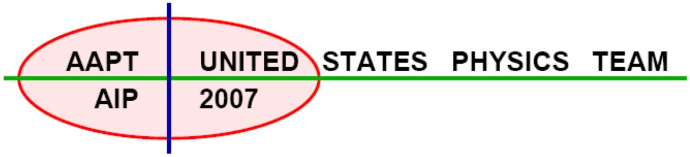

B1. A certain mechanical oscillator can be modeled as an ideal massless spring connected to a moveable plate on an incline. The spring has spring constant $k$, the plate has mass $m$, and the incline makes an angle $\theta$ with the horizontal. When the system is operating correctly, the plate oscillates between points $A$ and $B$ in the figure, located a distance $L$ apart. When the plate reaches point $A$ it has zero kinetic energy, but then trips a small lever that instantaneously loads a block of mass $M$ onto the plate. The block and plate then move down the incline to point $B$, where the force from the spring stops the plate. At this point, the block falls through a hole in the incline, allowing the plate to move back up under the force of the spring. Upon returning to point $A$ it collects another block, and the cycle repeats. Both the plate and the block have a coefficient of friction $\mu$ with the incline for both kinetic and static friction. It is reasonable that the motion in either direction is simple harmonic in nature.

(10 pts) a. Let $\mu_{c}$ be the critical value of the coefficient of friction where the block will just start to slide under the force of gravity on an incline (without the spring acting on it). Then let $\mu=\frac{\mu_{c}}{2}$. Find $\mu$ in terms of $g$, the acceleration of free fall, and any or all of the following variables: $\theta$ and $M$.

| AAPT | UNITED STATES PHYSICS TEAM |
| :--- | :--- |
| AIP | 2007 |

(14 pts) b. In order for this system to work correctly, it is necessary to have the correct ratio between the mass of the block and the mass of the plate. These masses are chosen so that the downward moving block and plate just stop at point $B$ while the upward moving plate just stops at point $A$. Find the ratio $R=\frac{M}{m}$.
(13 pts) c. The system delivers blocks to point $B$ with period $T_{0}$, until the blocks run out. After that, the plate alone oscillates with a period $T^{\prime}$. Find the ratio $\frac{T_{0}}{T^{\prime}}$.
(13 pts) d. The plate only oscillates a few times after delivering the last block. At what distance up the incline, measured from point $B$, does the plate come to a permanent stop?

