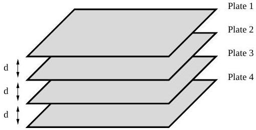
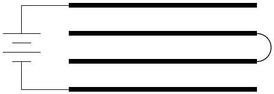
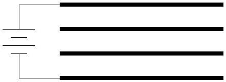
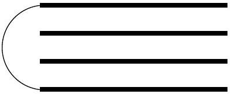

## Question A1

Four square metal plates of area $A$ are arranged at an even spacing $d$ as shown in the diagram. (Assume that $A \gg d^{2}$.)

Plates 1 and 4 are first connected to a voltage source of magnitude $V_{0}$, with plate 1 positive; plates 2 and 3 are then connected together with a wire. The wire is subsequently removed. Finally, the voltage source attached between plates 1 and 4 is replaced with a wire. The steps are summarized in the diagrams below.

Step 1

Step 2

Step 3

Find the resulting potential difference $\Delta V_{12}$ between plates 1 and 2; like wise find $\Delta V_{23}$ and $\Delta V_{34}$, defined similarly.

Assume, in each case, that a positive potential difference means that the top plate is at a higher potential than the bottom plate.
