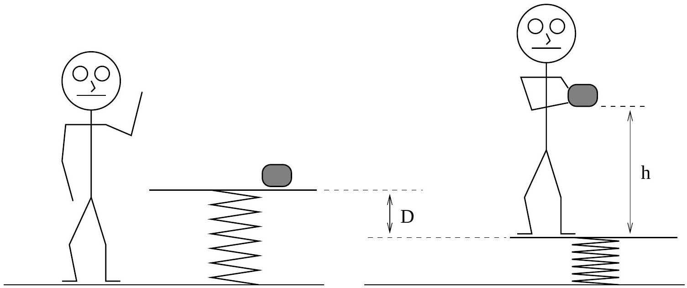

## Question B1

A platform is attached to the ground by an ideal spring of constant $k$; both the spring and the platform have negligible mass; assume that your mass is $m_{p}$. Sitting on the platform is a rather large lump of clay of mass $m_{c}=r m_{p}$, with $r$ some positive constant that measures the ratio $m_{c} / m_{p}$. You then gently step onto the platform, and the platform settles down to a new equilibrium position, a vertical distance $D$ below the original position. Throughout the problem assume that you never lose contact with the platform.

a. You then slowly pick up the lump of clay and hold it a height $h$ above the platform. Upon releasing the clay you and the platform will oscillate up and down; you notice that the clay strikes the platform after the platform has completed exactly one oscillation. Determine the numerical value of the ratio $h / D$.
b. Assume the resulting collision between the clay and the platform is completely inelastic. Find the ratio of the amplitude of the oscillation of the platform after the collision $\left(A_{\mathrm{f}}\right)$ to the amplitude of the oscillations of the platform before the collision $\left(A_{\mathrm{i}}\right)$. Determine $A_{\mathrm{f}} / A_{\mathrm{i}}$ in terms of the mass ratio $r$ and any necessary numerical constants.
c. Sketch a graph of the position of the platform as a function of time, with $t=0$ corresponding to the moment when the clay is dropped. Show one complete oscillation after the clay has collided with the platform. It is not necessary to use graph paper.
d. The above experiment is only possible if the mass ratio $r$ is less than some critical value $r_{c}$. Otherwise, despite the clay having been dropped from the height determined in part (a), the oscillating platform will hit the clay before the platform has completed one full oscillation. On your graph in part (c) sketch the position of the clay as a function of time relative to the position of the platform for the mass ratio $r=r_{c}$.
