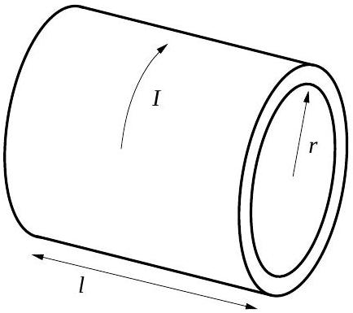

Question A1
A hollow cylinder has length $l$, radius $r$, and thickness $d$, where $l \gg r \gg d$, and is made of a material with resistivity $\rho$. A time-varying current $I$ flows through the cylinder in the tangential direction. Assume the current is always uniformly distributed along the length of the cylinder. The cylinder is fixed so that it cannot move; assume that there are no externally generated magnetic fields during the time considered for the problems below.

a. What is the magnetic field strength $B$ inside the cylinder in terms of $I$, the dimensions of the cylinder, and fundamental constants?
b. Relate the $\operatorname{emf} \mathcal{E}$ developed along the circumference of the cylinder to the rate of change of the current $\frac{d I}{d t}$, the dimensions of the cylinder, and fundamental constants.
c. Relate $\mathcal{E}$ to the current $I$, the resistivity $\rho$, and the dimensions of the cylinder.
d. The current at $t=0$ is $I_{0}$. What is the current $I(t)$ for $t>0$ ?
