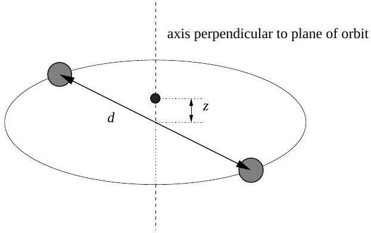

## Question A3

Two stars, each of mass $M$ and separated by a distance $d$, orbit about their center of mass. A planetoid of mass $m(m \ll M)$ moves along the axis of this system perpendicular to the orbital plane.

Let $T_{p}$ be the period of simple harmonic motion for the planetoid for small displacements from the center of mass along the $z$-axis, and let $T_{s}$ be the period of motion for the two stars. Determine the ratio $T_{p} / T_{s}$.

This problem was adapted from a problem by French in Newtonian Mechanics.
