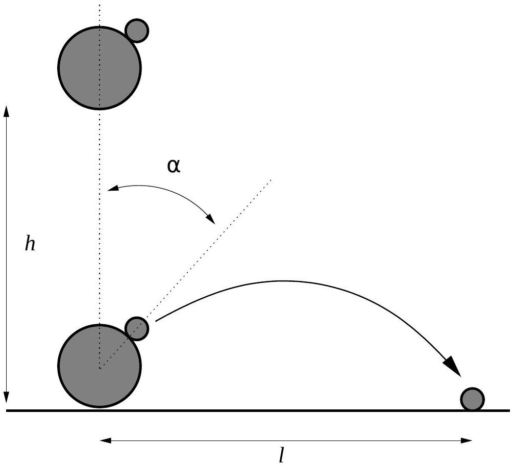

## Question B1

A bowling ball and a golf ball are dropped together onto a flat surface from a height $h$. The bowling ball is much more massive than the golf ball, and both have radii much less than $h$. The bowling ball collides with the surface and immediately thereafter with the golf ball; the balls are dropped so that all motion is vertical before the second collision, and the golf ball hits the bowling ball at an angle $\alpha$ from its uppermost point, as shown in the diagram. All collisions are perfectly elastic, and there is no surface friction between the bowling ball and the golf ball.

After the collision the golf ball travels in the absence of air resistance and lands a distance $l$ away. The height $h$ is fixed, but $\alpha$ may be varied. What is the maximum possible value of $l$, and at what angle $\alpha$ is it achieved?

You may present your results as decimals, but remember that you are not allowed to use graphical or algebraic functions of your calculator.
