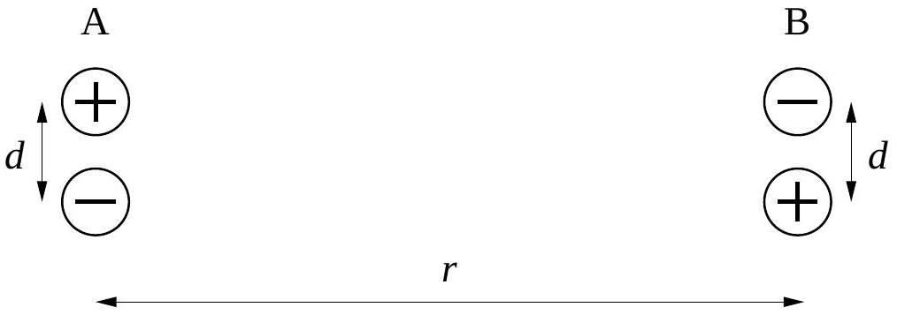

## Question B2

An electric dipole consists of two charges of equal magnitude $q$ and opposite sign, held rigidly apart by a distance $d$. The dipole moment is defined by $p=q d$.

Now consider two identical, oppositely oriented electric dipoles, separated by a distance $r$, as shown in the diagram.

a. It is convenient when considering the interaction between the dipoles to choose the zero of potential energy such that the potential energy is zero when the dipoles are very far apart from each other. Using this convention, write an exact expression for the potential energy of this arrangement in terms of $q, d, r$, and fundamental constants.
b. Assume that $d \ll r$. Give an approximation of your expression for the potential energy to lowest order in $d$. Rewrite this approximation in terms of only $p, r$, and fundamental constants.
c. What is the force (magnitude and direction) exerted on one dipole by the other? Continue to make the assumption that $d \ll r$, and again express your result in terms of only $p, r$, and fundamental constants.
d. What is the electric field near dipole B produced by dipole A? Continue to make the assumption that $d \ll r$ and express your result in terms of only $p, r$, and fundamental constants.
