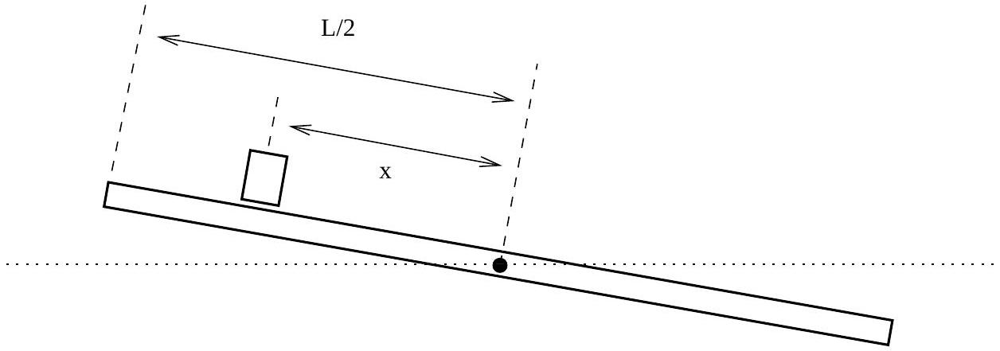

## Question B1

A thin plank of mass $M$ and length $L$ rotates about a pivot at its center. A block of mass $m \ll M$ slides on the top of the plank. The system moves without friction. Initially, the plank makes an angle $\theta_{0}$ with the horizontal, the block is at the upper end of the plank, and the system is at rest. Throughout the problem you may assume that $\theta \ll 1$, and that the physical dimensions of the block are much, much smaller than the length of the plank.

Let $x$ be the displacement of the block along the plank, as measured from the pivot, and let $\theta$ be the angle between the plank and the horizontal. You may assume that centripetal acceleration of the block is negligible compared with the linear acceleration of the block up and down the plank.

a. For a certain value of $\theta_{0}, x=k \theta$ throughout the motion, where $k$ is a constant. What is this value of $\theta_{0}$ ? Express your answer in terms of $M, m$, and any fundamental constants that you require.
b. Given that $\theta_{0}$ takes this special value, what is the period of oscillation of the system? Express your answer in terms of $M, m$, and any fundamental constants that you require.
c. Determine the maximum value of the ratio between the centripetal acceleration of the block and the linear acceleration of the block along the plank, writing your answer in terms of $m$ and $M$, therefore justifying our approximation.
