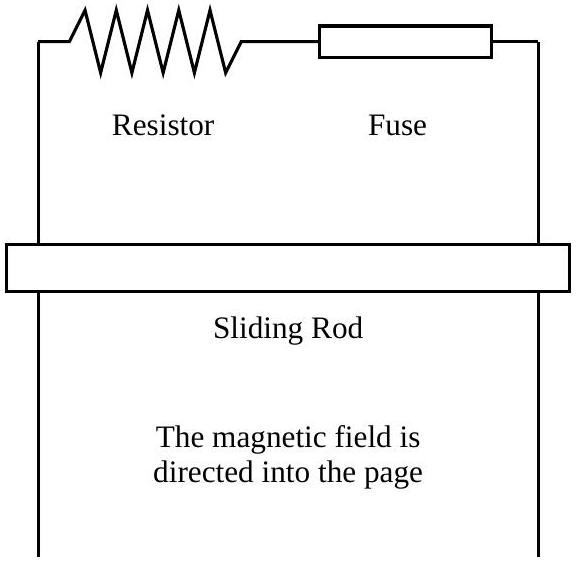

## Question B2

These three parts can be answered independently.

a. One pair of ends of two long, parallel wires are connected by a resistor, $R=0.25 \Omega$, and a fuse that will break instantaneously if 5 amperes of current pass through it. The other pair of ends are unconnected. A conducting rod of mass $m$ is free to slide along the wires under the influence of gravity. The wires are separated by 30 cm, and the rod starts out 10 cm from the resistor and fuse. The whole system is placed in a uniform, constant magnetic field of $B=1.2 \mathrm{~T}$ as shown in the figure. The resistance of the rod and the wires is negligible. When the rod is released is falls under the influence of gravity, but never loses contact with the long parallel wires.

    i. What is the smallest mass needed to break the fuse?
    ii. How fast is the mass moving when the fuse breaks?
b. A fuse is composed of a cylindrical wire with length $L$ and radius $r \ll L$. The resistivity (not resistance!) of the fuse is small, and given by $\rho_{\mathrm{f}}$. Assume that a uniform current $I$ flows through the fuse. Write your answers below in terms of $L, r, \rho_{\mathrm{f}}, I$, and any fundamental constants.
    i. What is the magnitude and direction of the electric field on the surface of the fuse wire?
    ii. What is the magnitude and direction of the magnetic field on the surface of the fuse wire?
    iii. The Poynting vector, $\overrightarrow{\mathbf{S}}$ is a measure of the rate of electromagnetic energy flow through a unit surface area; the vector gives the direction of the energy flow. Since $\overrightarrow{\mathbf{S}}=\frac{1}{\mu_{0}} \overrightarrow{\mathbf{E}} \times \overrightarrow{\mathbf{B}}$, where $\mu_{0}$ is the permeability of free space and and $\overrightarrow{\mathbf{E}}$ and $\overrightarrow{\mathbf{B}}$ are the electric and magnetic field vectors, find the magnitude and direction of the Poynting vector associated with the current in the fuse wire.
c. A fuse will break when it reaches its melting point. We know from modern physics that a hot object will radiate energy (approximately) according to the black body law $P=\sigma A T^{4}$, where $T$ is the temperature in Kelvin, $A$ the surface area, and $\sigma$ is the Stefan-Boltzmann constant. If $T_{\mathrm{f}}=500 \mathrm{~K}$ is the melting point of the metal for the fuse wire, with resistivity $\rho_{\mathrm{f}}=120 \mathrm{n} \Omega \cdot \mathrm{m}$, and $I_{\mathrm{f}}=5$ A is the desired breaking current, what should be the radius of the wire $r$ ?
