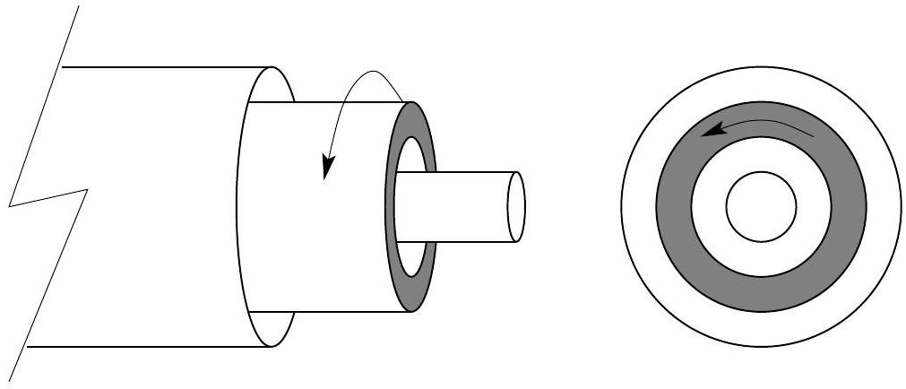

## Question A3

This problem inspired by the 2008 Guangdong Province Physics Olympiad
Two infinitely long concentric hollow cylinders have radii $a$ and $4 a$. Both cylinders are insulators; the inner cylinder has a uniformly distributed charge per length of $+\lambda$; the outer cylinder has a uniformly distributed charge per length of $-\lambda$.

An infinitely long dielectric cylinder with permittivity $\epsilon=\kappa \epsilon_{0}$, where $\kappa$ is the dielectric constant, has a inner radius $2 a$ and outer radius $3 a$ is also concentric with the insulating cylinders. The dielectric cylinder is rotating about its axis with an angular velocity $\omega \ll c / a$, where $c$ is the speed of light. Assume that the permeability of the dielectric cylinder and the space between the cylinders is that of free space, $\mu_{0}$.

a. Determine the electric field for all regions.
b. Determine the magnetic field for all regions.
