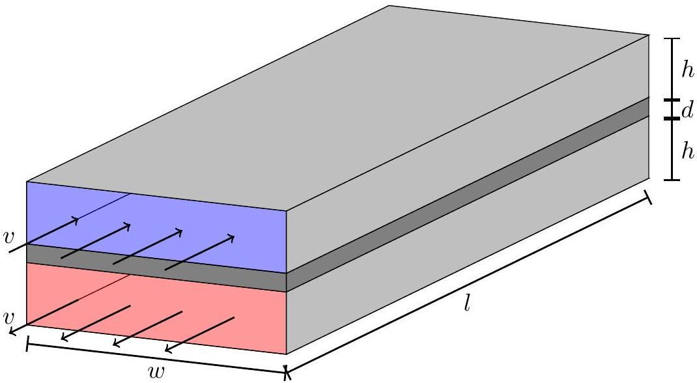

## Question A1

The flow of heat through a material can be described via the thermal conductivity $\kappa$. If the two faces of a slab of material with thermal conductivity $\kappa$, area $A$, and thickness $d$ are held at temperatures differing by $\Delta T$, the thermal power $P$ transferred through the slab is

$$
P=\frac{\kappa A \Delta T}{d}
$$

A heat exchanger is a device which transfers heat between a hot fluid and a cold fluid; they are common in industrial applications such as power plants and heating systems. The heat exchanger shown below consists of two rectangular tubes of length $l$, width $w$, and height $h$. The tubes are separated by a metal wall of thickness $d$ and thermal conductivity $\kappa$. Originally hot fluid flows through the lower tube at a speed $v$ from right to left, and originally cold fluid flows through the upper tube in the opposite direction (left to right) at the same speed. The heat capacity per unit volume of both fluids is $c$.

The hot fluid enters the heat exchanger at a higher temperature than the cold fluid; the difference between the temperatures of the entering fluids is $\Delta T_{i}$. When the fluids exit the heat exchanger the difference has been reduced to $\Delta T_{f}$. (It is possible for the exiting originally cold fluid to have a higher temperature than the exiting originally hot fluid, in which case $\Delta T_{f}<0$.)

Assume that the temperature in each pipe depends only on the lengthwise position, and consider transfer of heat only due to conduction in the metal and due to the bulk movement of fluid. Under the assumptions in this problem, while the temperature of each fluid varies along the length of the exchanger, the temperature difference across the wall is the same everywhere. You need not prove this.

Find $\Delta T_{f}$ in terms of the other given parameters.
